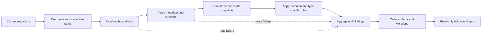

# Design

## Context And Constraints

The feature validates eight active SDD artifact types from the current
repository. It must be deterministic, offline, read-only, and complete even
when individual files are malformed or unreadable. It must not perform global
identity or relationship checks, lifecycle promotion, readiness evaluation, or
CLI output serialization.

The repository has no Rust workspace yet. The implementation will follow the
layer direction and testing rules in `specs/CONSTITUTION.md` without introducing
persistence or network access.

## Proposed Design

Create a layered Rust workspace with pure validation at the center and all
filesystem and parser concerns at the boundary.

- The `domain` crate owns artifact kinds, normalized validation inputs, rule
  evaluation, diagnostics, statuses, and deterministic ordering.
- The `application` crate owns the validation use case and the `ArtifactSource`
  port that supplies every canonical active candidate.
- The `adapters/artifact-filesystem` crate discovers canonical paths, reads
  files, and parses YAML frontmatter, Markdown structure, and Gherkin.
- The CLI composition root and output serialization are deferred to EPIC-004.

The adapter will use established crates at the boundary: `serde` with a
Serde-compatible YAML parser, `pulldown-cmark` for Markdown, `gherkin` for
feature files, and `thiserror` for typed library errors. Candidate dependency
versions, licences, transitive weight, and unsafe footprint will be audited and
pinned in the Rust workspace before implementation.

## Components And Responsibilities

| Component | Responsibility | Depends on |
| --- | --- | --- |
| Domain artifact model | Represents artifact kind, identity, source location, normalized metadata, document structure, diagnostics, and validation status without wire-format types | Standard library only |
| Domain rule evaluator | Applies common and type-specific metadata, section, checklist, placeholder, local ID, and local-reference rules | Domain artifact model |
| Domain report builder | Aggregates every finding, applies warning failure semantics, and orders artifact results and violations | Domain artifact model and rule evaluator |
| Application validation use case | Requests all active candidates, invokes pure validation, and returns the complete report | Domain and `ArtifactSource` |
| `ArtifactSource` port | Supplies canonical candidates, including per-file read failures, without exposing filesystem types | Application domain types |
| Filesystem source adapter | Discovers canonical active locations, reads bytes, retains repository-relative paths, and represents read failures as candidates | Application port and standard library |
| Frontmatter parser adapter | Extracts frontmatter and maps YAML into normalized metadata while retaining source locations | `serde` and the selected YAML parser |
| Markdown parser adapter | Produces heading and checklist structure for the Markdown artifact validators | `pulldown-cmark` |
| Gherkin parser adapter | Parses feature files and exposes feature, scenario, and step structure | `gherkin` |

## Interfaces And Contracts

| Interface | Inputs | Outputs | Errors |
| --- | --- | --- | --- |
| `ArtifactSource` | Current repository root | All canonical active candidates in discovery order, including candidates with read failures | Repository-level discovery failure as a typed operational error; individual file failures remain candidates |
| Validation use case | Candidate collection and fixed validation policy | `ValidationReport` with overall result, ordered artifact results, and ordered violations | No per-artifact failure aborts the report |
| Parser adapter | Repository-relative path and file content | Normalized metadata, document structure, source locations, and parser findings | Malformed content becomes a finding attached to the candidate path |
| Diagnostic model | Rule ID, path, optional location, severity, message, remediation | Immutable diagnostic entry | Invalid diagnostic construction is rejected before report assembly |

Domain-facing interfaces use domain types only. Filesystem, YAML, Markdown,
Gherkin, and serialization types do not cross into the domain crate.

## Data And State Flow

The source adapter may discover paths in filesystem order, but the domain report
builder always applies the approved result order: PRD, EPIC, user story,
Gherkin, requirements, design, ADR, TASK; ascending ID within each type; no-ID
results afterward by repository-relative path; and violations by rule ID and
location.

An empty candidate collection produces a successful report with no artifact
results. A readable candidate can produce many findings. A read or parse failure
produces a path-based diagnostic and does not prevent other candidates from
being processed.

## Security, Performance, And Operations

- Security: Read only from the current repository's canonical active paths. Do
  not access the network, execute artifact content, or write source or result
  files.
- Performance: Read and parse each candidate once, keep parser work local, and
  sort only normalized results. The product-level pull-request runtime target
  remains deferred.
- Operations: Return a typed operational error only when repository discovery
  itself cannot be established. Per-file read and parse failures remain visible
  diagnostics. No background work, cache, or persisted state is introduced.

## Alternatives Considered

| Alternative | Why not chosen |
| --- | --- |
| Monolithic CLI validator | Couples command handling, filesystem access, parsing, rules, and output, making pure rule tests and future command changes expensive |
| Custom parsers for every input format | Increases syntax risk and duplicates established YAML, Markdown, and Gherkin parsing behavior |
| Parser and serialization types in the domain crate | Couples business rules to external wire formats and violates the constitution's separation rules |
| Global rule registry or plugin system | Adds speculative indirection when the supported artifact types are fixed for the MVP |

## Risks And Open Decisions

- The YAML parser dependency must pass the constitution's licence, advisory,
  transitive-weight, and unsafe-footprint review before workspace creation.
- Parser libraries may accept constructs outside the SDD contract; adapter
  checks will enforce the repository-specific headers and structures after
  parsing.
- The current repository contains unresolved-value markers in existing
  specifications; the agreed validator policy will report those as diagnostics.
- Exact CLI invocation and machine-readable serialization remain open for
  EPIC-004 and are intentionally absent from this slice.

## Verification Approach

- Write domain tests first for every `FR-*` rule, including type ordering,
  identifier ordering, no-ID fallback, warning failure semantics, placeholder
  findings, and complete aggregation.
- Write application tests against an in-memory `ArtifactSource` for empty,
  valid, invalid, multi-finding, and per-file failure cases.
- Write adapter tests for canonical path discovery, parser structure, source
  locations, malformed frontmatter, unreadable candidates, and excluded paths.
- Run acceptance tests for every scenario in `scenarios.feature`.
- Cite `REQ-001` and the covered `FR-*` identifier in each test name or doc
  comment as required by `R-SDD-02`.
- Run the constitution's Rust gates through `cargo xtask ci` once the workspace
  exists: formatting, clippy, tests, documentation, dependency audit, and
  coverage.
