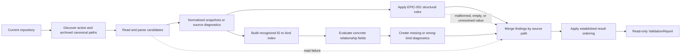

# Design

## Context And Constraints

EPIC-001 already recognizes canonical active artifacts, normalizes frontmatter
and document structure, applies structural rules, and returns an ordered
`ValidationReport`. US-002 extends repository discovery to active and historical
artifacts through `ArtifactIdentitySource`. US-003 can therefore resolve
relationship targets from the same complete candidate set without changing the
active-only `ArtifactSource` contract or filesystem discovery policy.

The design must preserve the approved constraints:

- Relationship checks are deterministic, offline, complete, and read-only.
- Recognized archived and superseded artifacts are eligible targets.
- Templates and non-artifact supporting documents remain excluded.
- Malformed, empty, and unresolved relationship values remain EPIC-001
  structural findings and are not reinterpreted as target failures.
- Domain rules remain pure and independent of YAML, Markdown, Gherkin, and
  filesystem types.
- Application code owns orchestration and ports; the filesystem adapter owns
  discovery, reading, and parsing, following ADR-005 and ADR-006.
- The existing `ValidationReport`, `ArtifactResult`, and diagnostic ordering
  contracts are reused.
- No CLI, serialization, persistence, schema, release, reciprocal-link, or
  cycle-detection behavior is introduced.
- No new crate, workspace member, parser dependency, or architectural layer is
  introduced.

## Proposed Design

Add a pure domain relationship evaluator and a separate application use case:

- `domain::validate_relationships` evaluates concrete relationship values in
  normalized snapshots against an in-memory target index.
- `application::RelationshipValidator<S>` obtains active and historical
  candidates through the existing `ArtifactIdentitySource`, builds the base
  structural results, evaluates relationships, merges findings by source path,
  and returns the existing `ValidationReport`.
- `FilesystemArtifactSource` is reused unchanged for the relationship scope;
  its `discover_identities` implementation already includes active and archived
  canonical paths while excluding templates and supporting files.

The domain evaluator builds an ordered target index keyed by recognized
`ArtifactId` and records the recognized `ArtifactKind` values for each ID. It
then scans the fixed relationship fields in a fixed order. Only concrete values
that pass the existing local-reference syntax and unresolved-marker boundary
are looked up. A missing ID produces a missing-target diagnostic. A present ID
whose recognized kinds contain none of the expected kinds produces a wrong-kind
diagnostic. Fields that accept any recognized artifact succeed when the ID is
present. Empty, null, mapping, malformed, and unresolved values are skipped by
target evaluation so the existing structural validator remains authoritative.

Expected-kind policy is represented as a pure domain rule:

- `parent` on an epic or user story expects `Prd`.
- `parent` on requirements, design, or task artifacts expects `UserStory`.
- `epic` on a user story expects `Epic`.
- `depends_on`, `requires`, `blockers`, and `related` accept any recognized
  artifact kind.
- `supersedes` and `superseded_by` expect the source artifact's kind.

Relationship diagnostics use the global stable rule IDs
`ARTIFACT.RELATIONSHIP.MISSING_TARGET` and
`ARTIFACT.RELATIONSHIP.WRONG_KIND`. They attach to the source artifact, use no
source location because normalized metadata currently retains no field
locations, and include the field, target ID, and expected/actual kind context
required by REQ-003. Human-readable wording remains flexible.

## Components And Responsibilities

| Component | Responsibility | Depends on |
| --- | --- | --- |
| Domain relationship evaluator | Build a recognized target index, apply relationship field applicability and expected-kind rules, and emit complete stable diagnostics without I/O | Domain artifact snapshots, IDs, kinds, metadata, and diagnostics |
| Domain relationship field policy | Define the fixed field scan order, concrete-value boundary, and expected target kind for each applicable source kind and field | `ArtifactKind` and normalized metadata values |
| Existing domain report model | Merge structural and relationship diagnostics, derive per-artifact and overall status, and apply established ordering | Domain diagnostics and artifact results |
| `ArtifactIdentitySource` port | Supply normalized candidates from active and historical canonical locations | Application candidate and validation error types |
| Relationship validation use case | Orchestrate candidate loading, structural validation, pure relationship evaluation, diagnostic merging, and final report creation | `ArtifactIdentitySource` and domain relationship evaluator |
| Existing filesystem source | Provide the complete active-plus-historical candidate set and preserve excluded-path behavior | Existing filesystem discovery and parser adapter |
| Existing in-memory source double | Supply deterministic candidates and repository-level failures to application tests | `ArtifactIdentitySource` |

No new adapter component or supporting specification artifact is required.

## Interfaces And Contracts

| Interface | Inputs | Outputs | Errors |
| --- | --- | --- | --- |
| `domain::validate_relationships` | Normalized snapshots containing recognized IDs, kinds, and metadata | Relationship diagnostics in stable order | No operational errors; invalid target state becomes diagnostics |
| Relationship field policy | Source `ArtifactKind` and relationship field name | Applicability and optional expected target kind | Unsupported or non-applicable fields produce no target evaluation |
| `ArtifactIdentitySource` | Repository context held by the concrete source | `Result<Vec<ArtifactCandidate>, ValidationError>` containing active and historical candidates | `ValidationError::Discovery` only when the repository-wide candidate set cannot be established; per-file failures remain candidates |
| `RelationshipValidator<S>::validate` | An injected `ArtifactIdentitySource` | Existing `ValidationReport` with structural findings, relationship findings, ordered artifact results, and overall status | Propagates repository-level discovery failure; does not abort on candidate-level or relationship failures |
| Relationship diagnostic construction | Source path, field, target ID, expected kind, and actual kind when present | Actionable error diagnostic with stable relationship rule ID | No separate error channel; construction is infallible for normalized domain values |

The relationship use case follows the existing identity orchestration contract:
source candidates without snapshots become path-based source results, readable
snapshots receive structural validation first, and relationship diagnostics are
merged by source path through `ArtifactResult::with_diagnostics`. The resulting
report therefore retains both EPIC-001 findings and US-003 findings.

## Data And State Flow

The operation proceeds as follows:

1. `RelationshipValidator` requests candidates through
   `discover_identities`.
2. A repository-level discovery failure returns the existing typed operational
   error. Per-file read failures remain path-based artifact results.
3. All readable snapshots are retained. The application creates their base
   structural results using the existing domain rule evaluator.
4. The domain relationship evaluator indexes every recognized snapshot ID and
   scans every applicable relationship value in deterministic field order.
5. Each invalid concrete entry creates one diagnostic attached to its source
   path. Valid and unrelated snapshots remain in the result collection.
6. The application merges relationship findings into the base results and the
   existing report builder orders artifacts and violations.
7. A clean or empty candidate set produces an overall success unless existing
   structural diagnostics are present. Relationship target errors produce
   diagnostic artifact results and overall failure.

No rollback is needed because the operation performs no mutation. Rerunning the
validator against the same repository state is the recovery behavior.

## Security, Performance, And Operations

- Security: Read only from the supplied repository's canonical active and
  historical `specs/` paths through the existing source; exclude templates and
  supporting files; do not execute content, access the network, or write source
  or result files.
- Performance: Read and parse each candidate once, build the target index with
  ordered collections, and perform indexed lookups for each concrete reference.
  The work is linear in references after ordered index construction, with the
  existing report sorting cost. PRD-001's exact runtime threshold remains
  unspecified.
- Operations: Preserve per-file source and structural failures in the complete
  report. Treat only inability to establish the repository-wide candidate set as
  a terminal operational error. No cache, retry, background work, or migration
  is introduced.
- Compatibility: The existing active `Validator` and `ArtifactSource` behavior
  remain unchanged. The relationship use case opts into the existing
  active-plus-historical `ArtifactIdentitySource` scope.

## Alternatives Considered

| Alternative | Why not chosen |
| --- | --- |
| Add a new relationship source port | Duplicates the already-approved active-plus-historical candidate contract and adds an unnecessary seam |
| Extend `ArtifactSource` with a scope parameter | Changes EPIC-001's active-only contract and moves historical-scope policy to callers |
| Combine identity and relationship checks into `IdentityValidator` | Couples independently valuable slices and prevents callers from requesting relationship validation without identity diagnostics |
| Resolve relationships in the filesystem adapter | Places pure business rules at the I/O boundary and prevents filesystem-free domain tests |
| Resolve each target by rescanning the filesystem | Repeats I/O, makes completeness and determinism harder to guarantee, and violates the read-once flow |
| Create a separate relationship report type | Duplicates the approved `ValidationReport` contract and complicates later CLI composition |

## Risks And Open Decisions

- Relationship diagnostics currently have no metadata field source location
  because `Metadata` retains values but not YAML field locations. The required
  path, field, target, rule, severity, message, and remediation context remains
  available; exact line reporting is not required by REQ-003.
- Duplicate identities remain governed by US-002 and its identity diagnostics.
  The relationship index records recognized target kinds without replacing or
  suppressing duplicate-identity findings. Relationship tests must ensure that
  identity diagnostics are not duplicated as relationship failures.
- The filesystem source already owns active and historical discovery, so no
  adapter change is expected. Adapter tests must nevertheless prove that the
  relationship use case receives archived and superseded targets while still
  excluding templates and supporting files.
- Reciprocal relationships, graph cycles, schema and release links, lifecycle
  promotion, Spec-Ready evaluation, CLI output, serialization, persistence,
  and mutation remain deferred or out of scope.
- No unresolved or blocking technical decision remains.

## Verification Approach

- Write domain tests first for empty and null values, malformed and unresolved
  values, valid target resolution, missing targets, wrong-kind mappings, every
  expected-kind rule, any-kind fields, one diagnostic per invalid entry,
  complete continuation, duplicate target IDs, and deterministic ordering.
- Write application tests against the in-memory `ArtifactIdentitySource` for
  empty input, valid and historical candidates, missing and wrong-kind findings,
  structural-diagnostic preservation, unrelated-result retention, typed source
  failure, and repeated identical reports.
- Write adapter integration tests with temporary active, archived, superseded,
  template, and supporting paths to verify the existing discovery boundary and
  the complete relationship report.
- Add acceptance coverage for every scenario in `scenarios.feature`, with test
  names or doc comments citing the corresponding `REQ-003` and `FR-*` IDs.
- Run the repository's Rust quality gates through `cargo xtask ci`, plus the
  existing `cargo machete` and fuzz-target smoke checks, and record observed
  output in `tasks.md` during the implementation and verification stages.
