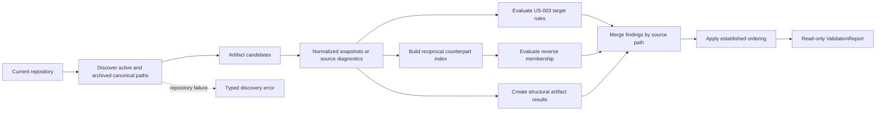

# Design

<!-- Design explains how the approved behavior will be realized. Link to ADRs
for consequential decisions and keep requirements in requirements.md. -->

## Context And Constraints

EPIC-001 recognizes canonical artifacts, normalizes frontmatter and document
structure, applies structural rules, and returns an ordered `ValidationReport`.
US-002 provides repository-wide identity discovery through
`ArtifactIdentitySource`. US-003 resolves concrete relationship targets and
expected kinds through a pure domain evaluator and an application use case.

US-004 adds reciprocal consistency without changing the approved US-003 target
validation contract. The design must preserve these constraints:

- Reciprocity is deterministic, complete, offline, and read-only.
- Recognized active, archived, and `superseded` artifacts participate in the
  same counterpart set.
- Templates and non-artifact supporting files remain excluded by the existing
  filesystem discovery boundary.
- Only concrete, syntactically valid, resolved entries are eligible for
  reciprocity evaluation.
- EPIC-001 structural diagnostics and US-003 target diagnostics remain the
  source of truth and are not duplicated by this slice.
- Domain rules remain pure and independent of YAML, Markdown, Gherkin, and
  filesystem types.
- Application code owns orchestration and process-boundary ports; the existing
  filesystem adapter owns discovery, reading, and parsing.
- The existing `ArtifactCandidate`, `ArtifactResult`, `ValidationReport`, and
  diagnostic ordering contracts are reused.
- No new crate, workspace member, parser dependency, architectural layer,
  persistence mechanism, schema, CLI, or serialization boundary is introduced.

## Proposed Design

Add a separate pure reciprocity evaluator and a separate application use case
that composes it with the existing relationship-target evaluator:

- `domain::validate_reciprocal_relationships` evaluates the three approved
  reciprocal field mappings against normalized snapshots and returns only
  `ARTIFACT.RELATIONSHIP.NON_RECIPROCAL` diagnostics.
- `application::ReciprocalRelationshipValidator<S>` obtains the active and
  historical candidate set through the existing `ArtifactIdentitySource`,
  creates the base structural results, runs both the existing target evaluator
  and the new reciprocity evaluator over the same snapshots, merges all
  findings by source path, and returns the existing `ValidationReport`.
- `FilesystemArtifactSource` is reused unchanged for this scope. Its existing
  identity discovery includes active and archived canonical paths while
  excluding templates and supporting files.
- The existing `RelationshipValidator<S>` and
  `domain::validate_relationships` remain target-only, preserving the US-003
  public behavior. Callers that need US-004 behavior use the new application
  entry point.

The domain evaluator uses the existing normalized identifier and metadata
boundaries. It builds deterministic indexes for recognized target IDs, their
recognized kinds, and the concrete reverse memberships exposed by each target.
It then scans `related`, `supersedes`, and `superseded_by` in fixed order. A
source entry is checked only when its source ID is recognized, its value has the
approved field shape, its reference is a valid local identifier, and the target
is recognized with an applicable kind. The mapped reverse membership is
checked as a set, so ordering and repeated values do not affect the result.

When the mapped membership is absent, the evaluator creates one diagnostic on
the source path. The diagnostic includes the source field, target ID, required
reverse field, stable rule ID, error severity, actionable message, and
remediation. No source location is added because the current normalized
metadata model does not retain YAML field locations.

## Components And Responsibilities

| Component | Responsibility | Depends on |
| --- | --- | --- |
| Domain reciprocity evaluator | Evaluate concrete resolved reciprocal entries and emit complete stable non-reciprocal diagnostics without I/O | Domain snapshots, identifiers, metadata values, diagnostic types, and ordered collections |
| Domain reciprocal field policy | Define the fixed field scan order and map each source field to its required reverse field | `ArtifactKind` and normalized relationship metadata |
| Domain counterpart index | Associate recognized target IDs with recognized kinds and concrete reverse memberships | `ArtifactSnapshot`, `ArtifactId`, and `MetadataValue` |
| Existing domain target evaluator | Preserve US-003 missing-target and wrong-kind diagnostics | Existing `validate_relationships` contract |
| Existing domain report model | Merge structural, target, and reciprocity findings, derive statuses, and apply stable ordering | `ArtifactResult`, `Diagnostic`, and `ValidationReport` |
| `ArtifactIdentitySource` port | Supply the complete active-plus-historical candidate set | Existing application candidate and typed error contracts |
| Reciprocal relationship use case | Orchestrate one candidate discovery, base results, target evaluation, reciprocity evaluation, diagnostic merging, and final report creation | `ArtifactIdentitySource`, `validate_relationships`, `validate_reciprocal_relationships`, and report model |
| Existing filesystem source | Discover canonical paths, read files, and map parser output without changing scope policy | Existing filesystem discovery and parser adapter |
| Existing in-memory identity source double | Supply deterministic candidates and repository-level failures for application tests | `ArtifactIdentitySource` |

No new adapter, port, supporting schema, chart, or ADR is required.

## Interfaces And Contracts

| Interface | Inputs | Outputs | Errors |
| --- | --- | --- | --- |
| `domain::validate_reciprocal_relationships` | Normalized snapshots containing recognized IDs, kinds, and relationship metadata | Stable `Vec<Diagnostic>` containing only non-reciprocal relationship findings | No operational errors; ineligible or invalid relationship values are skipped and remain owned by earlier validators |
| Reciprocal field policy | Source artifact kind and one of `related`, `supersedes`, or `superseded_by` | Applicable reverse field and supersession kind rule | Non-applicable fields produce no reciprocity evaluation |
| Counterpart index | Recognized snapshots and concrete reverse-field values | Deterministic ID-to-kind and ID-to-membership lookup | No operational errors; malformed normalized values do not become memberships |
| `ArtifactIdentitySource` | Repository context held by the concrete source | `Result<Vec<ArtifactCandidate>, ValidationError>` with active and historical candidates | `ValidationError::Discovery` only when the repository-wide candidate set cannot be established; per-file failures remain candidates |
| `ReciprocalRelationshipValidator<S>::new` | An injected `ArtifactIdentitySource` | A configured reciprocal relationship validator | Infallible construction |
| `ReciprocalRelationshipValidator<S>::validate` | The injected source's current repository view | Existing ordered `ValidationReport` with structural, target, and reciprocity findings | Propagates repository-level discovery failure; candidate-level, structural, target, and reciprocity failures remain in the report |
| Reciprocity diagnostic construction | Source path, source field, target ID, required reverse field, and source relationship kind | Actionable error diagnostic using `ARTIFACT.RELATIONSHIP.NON_RECIPROCAL` | Infallible for normalized domain values |

The reciprocity field mappings are fixed by REQ-004:

| Source field | Required reverse field | Target kind condition |
| --- | --- | --- |
| `related` | `related` | Any recognized artifact kind |
| `supersedes` | `superseded_by` | Same recognized kind as the source |
| `superseded_by` | `supersedes` | Same recognized kind as the source |

The application use case follows the existing relationship orchestration
contract:

1. Discover candidates once through `ArtifactIdentitySource`.
2. Preserve candidates without snapshots as path-based source results.
3. Build base results from snapshots so parser and structural diagnostics stay
   attached to their original artifacts.
4. Run the existing target evaluator and the new reciprocity evaluator over the
   same snapshot collection.
5. Group both diagnostic collections by source path and merge them into the
   base results using `ArtifactResult::with_diagnostics`.
6. Build `ValidationReport`, which applies the established artifact and
   diagnostic ordering and derives the overall status.

The new domain function performs its own eligibility boundary consistently with
REQ-003: empty, null, mapping, malformed, unresolved, missing-target, and
wrong-kind values do not become reciprocity findings. This keeps the pure
function independent of an application report while preventing duplicate
ownership across validators.

## Data And State Flow

The operation has no mutable state or rollback path:

1. The filesystem source validates the repository root and discovers the
   identity scope. A repository-level discovery failure returns the typed
   application error and no partial success claim.
2. Each eligible path is read and parsed once. Per-file failures become
   candidates with source diagnostics.
3. Readable snapshots are retained for structural, target, and reciprocity
   evaluation. Templates and supporting documents never enter this flow.
4. The counterpart index stores only recognized IDs and concrete reverse
   memberships. Supersession lookups additionally require the source kind to
   be present among the target's recognized kinds.
5. Every eligible unmatched directed entry creates one source-owned diagnostic;
   evaluation continues through all snapshots and fields.
6. The application merges all findings and constructs the existing ordered
   report. Any structural, target, or reciprocity finding produces overall
   `Failure`; an empty or clean eligible set produces `Success`.
7. Rerunning against the same repository state is the recovery behavior and
   returns the same ordered report.

## Security, Performance, And Operations

- Security: Read only from the supplied repository's canonical active and
  historical `specs/` paths through the existing source. Do not execute file
  content, access the network, write source files, or persist validation
  results.
- Performance: Discover and parse each candidate once, build ordered indexes
  for recognized IDs and reverse memberships, and perform indexed lookups for
  each eligible relationship. Evaluation is linear in snapshots and concrete
  references apart from ordered-map lookup costs and final report sorting.
  PRD-001's exact runtime threshold remains unspecified.
- Operations: Preserve per-file source, structural, target, and reciprocity
  findings in the complete report. Treat only failure to establish the
  repository-wide candidate set as a terminal operational error. No cache,
  retry, background work, migration, or cleanup is introduced.
- Compatibility: Existing active-only `Validator` behavior, the existing
  target-only `RelationshipValidator`, `ArtifactSource`,
  `ArtifactIdentitySource`, parser dependencies, and report types remain
  compatible. Reciprocity is opt-in through the new application use case.

## Alternatives Considered

| Alternative | Why not chosen |
| --- | --- |
| Extend `RelationshipValidator` and `validate_relationships` in place | Changes the approved US-003 target-only contract and would make existing target callers receive new reciprocal findings without opting in |
| Add a new filesystem or relationship source port | Duplicates the approved active-plus-historical candidate boundary and adds no process seam |
| Resolve counterparts in the filesystem adapter | Places a pure graph rule at the I/O boundary and prevents filesystem-free domain tests |
| Rescan the filesystem for every relationship entry | Repeats I/O, weakens completeness and determinism, and violates the one-read state flow |
| Create a separate reciprocal report type | Duplicates the approved `ValidationReport` contract and complicates future CLI composition |
| Compare relationship lists by position or multiplicity | Conflicts with REQ-004's unordered membership and duplicate-insensitive behavior |

## Risks And Open Decisions

- Duplicate artifact IDs remain governed by US-002. The counterpart index uses
  the existing REQ-003 recognized-ID semantics and deduplicates membership
  values, so duplicate identities do not create duplicate reciprocity findings.
  Identity validation remains responsible for reporting the collision.
- A malformed or structurally invalid reverse field cannot satisfy membership.
  The reverse field's existing structural finding remains intact, while a
  concrete valid source entry can still be diagnosed as unmatched, as required
  by the directed-entry contract.
- The current normalized metadata model does not retain YAML field locations.
  Reciprocity diagnostics therefore use no line or column while retaining
  source path, field, target, rule, severity, message, and remediation context.
- Exact human-readable diagnostic wording remains flexible; the stable rule ID
  and required diagnostic context are the contract.
- Parent, dependency, and supersession cycle detection, schema and release
  links, lifecycle promotion, Spec-Ready evaluation, CLI output,
  serialization, persistence, and mutation remain deferred or out of scope.
- No unresolved or blocking technical decision remains, and no new ADR is
  required because existing ADR-005 and ADR-006 cover the selected layering,
  parser boundary, and historical discovery seam.

## Verification Approach

- Write domain tests first for reciprocal `related` membership across active
  and historical snapshots, both supersession mappings, missing counterparts,
  different reverse targets, empty values, malformed and unresolved values,
  missing and wrong-kind targets, duplicate occurrences, list-order changes,
  multiple findings, and deterministic output. Tests cite `REQ-004` and the
  applicable `FR-*` identifiers.
- Write application tests through the public API using the existing in-memory
  `ArtifactIdentitySource` double. Cover empty success, reciprocal success,
  non-reciprocal failure, combined target and reciprocity findings,
  structural-diagnostic preservation, per-file source diagnostics, unrelated
  result retention, typed discovery failure, and repeated identical reports.
- Write filesystem integration tests using temporary repositories with active,
  archived, superseded, template, and supporting paths. Cover every approved
  scenario, verify excluded paths cannot satisfy counterparts, and compare
  source bytes and lifecycle metadata before and after validation.
- Add scenario-equivalent acceptance coverage for all 11 approved Gherkin
  scenario headings, including both Scenario Outline examples. Keep CLI and
  serialization tests deferred to EPIC-004.
- Run the constitutional Rust quality suite through `cargo xtask ci`, along
  with the existing `cargo machete` and fuzz-target smoke checks, and record
  observed output in `tasks.md` during implementation and verification.
- Verify dependency direction remains `application -> domain` and adapter ->
  application/domain, no new dependency is introduced, public items are
  documented, and the existing active-only validation behavior is unchanged.

## Traceability

- Source story: `US-004`
- Parent epic: `EPIC-002`
- Approved requirements: `REQ-004`
- Preceding target-validation design: `DES-003`
- Identity design and discovery boundary: `DES-002` and `ADR-006`
- Layering and parser boundary: `ADR-005`
- Lifecycle authority: `ADR-002`
- Packet layout and epic linkage: `ADR-003` and `ADR-004`
- Executable scenarios: `scenarios.feature`
- Functional coverage: `REQ-004` FR-001 through FR-010
