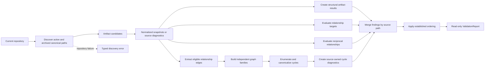

# Design

<!-- Design explains how the approved behavior will be realized. Link to ADRs
for consequential decisions and keep requirements in requirements.md. -->

## Context And Constraints

EPIC-001 provides pure structural validation over normalized
`ArtifactSnapshot` values and the existing ordered `ValidationReport`. US-002
provides `ArtifactIdentitySource` discovery across active and historical
artifacts. US-003 provides relationship target and expected-kind validation,
and US-004 adds reciprocal relationship findings over the same candidate set.

The cycle slice must preserve these constraints:

- Cycle detection is deterministic, complete, offline, and read-only.
- Recognized active, archived, and `superseded` artifacts use one graph input
  set.
- Templates and non-artifact supporting files remain outside the graph.
- Only concrete, syntactically valid, resolved, expected-kind-valid entries
  become graph edges.
- A target-valid entry with a non-reciprocal finding remains eligible.
- Parent, dependency, and supersession edges remain independent graph families.
- Existing structural, target, reciprocal, candidate, and report contracts are
  preserved.
- Domain logic remains independent of YAML, Markdown, Gherkin, and filesystem
  types.
- No new crate, workspace member, parser dependency, port, persistence
  mechanism, schema, CLI, or serialization boundary is introduced.

## Proposed Design

Add a pure domain cycle evaluator and a separate application use case:

- `domain::validate_relationship_cycles` receives normalized snapshots and
  returns only cycle diagnostics. It does not read files, inspect prior reports,
  or return operational errors.
- An internal eligible-edge extraction boundary reuses the existing relationship
  syntax, field-shape, target-index, and expected-kind policy. It emits only
  graph edges that are concrete, resolved, and target-kind-valid.
- The evaluator builds independent parent, dependency, and supersession graphs.
  Dependency edges come from `depends_on`, `requires`, and `blockers`.
- Supersession edges are normalized before graph construction. `supersedes`
  points from source to target; `superseded_by` points from its source to the
  referenced superseder.
- A deterministic simple-cycle traversal enumerates every directed cycle. Each
  traversal starts at the lowest ordered node permitted for that path, and a
  canonical rotation key provides a second duplicate guard.
- Canonical cycle identity includes the relationship family and ordered directed
  edge keys, so rotation-equivalent cycles collapse while different overlapping
  edge sets remain distinct.
- Every participating source relationship entry receives one
  `ARTIFACT.RELATIONSHIP.CYCLE` diagnostic for each cycle identity in which it
  participates.
- `application::CycleValidator<S>` discovers candidates once through the
  existing `ArtifactIdentitySource`, runs structural, target, reciprocal, and
  cycle evaluation over the same snapshots, merges findings by source path, and
  returns the existing `ValidationReport`.
- Existing `Validator`, `RelationshipValidator`, and
  `ReciprocalRelationshipValidator` remain unchanged. Callers opt into the
  complete cycle-aware validation through `CycleValidator`.

The traversal is an internal pure algorithm rather than a new architectural
boundary. No new ADR is required: ADR-005 and ADR-006 already govern the layer
and source boundaries, while REQ-005 governs the observable cycle behavior.

## Components And Responsibilities

| Component | Responsibility | Depends on |
| --- | --- | --- |
| Domain cycle evaluator | Evaluate all eligible relationship cycles and emit stable source-owned diagnostics without I/O | `ArtifactSnapshot`, relationship metadata, ordered collections, and diagnostic types |
| Eligible-edge extraction | Apply concrete-value, field-shape, target-resolution, and expected-kind rules before graph construction | Existing relationship policy and recognized artifact index |
| Cycle family policy | Map `parent`, dependency fields, and supersession fields to independent graph families and normalize supersession direction | `ArtifactKind` and relationship field names |
| Cycle identity and traversal | Enumerate simple directed cycles, canonicalize rotations, and retain distinct overlapping edge sets | Ordered graph edges and stable artifact identifiers |
| Cycle diagnostic construction | Attach one cycle finding to each participating source relationship entry with family and canonical identity context | Source path, field, target, cycle identity, and `Diagnostic` |
| Existing domain report model | Merge structural and cross-artifact findings, derive statuses, and apply stable ordering | `ArtifactResult`, `Diagnostic`, and `ValidationReport` |
| `ArtifactIdentitySource` port | Supply the complete active-plus-historical candidate set | Existing application candidate and typed error contracts |
| Cycle validation use case | Orchestrate one discovery, base results, prior relationship evaluators, cycle evaluation, merge, and final report construction | `ArtifactIdentitySource`, existing relationship evaluators, cycle evaluator, and report model |
| Existing filesystem source | Discover canonical files, read them, and map parser output without a scope change | Existing filesystem discovery and parser adapter |
| Existing in-memory source double | Supply deterministic candidates and discovery failures for application tests | `ArtifactIdentitySource` |

No database, table, chart, adapter, or supporting artifact is required.

## Interfaces And Contracts

| Interface | Inputs | Outputs | Errors |
| --- | --- | --- | --- |
| `domain::validate_relationship_cycles` | Normalized snapshots containing recognized IDs, kinds, and metadata | Stable `Vec<Diagnostic>` containing only cycle findings | No operational errors; ineligible values are skipped and remain owned by earlier validators |
| Eligible-edge extraction | Recognized snapshots and relationship field metadata | Ordered eligible edges with source path, source ID, field, target ID, and family | No operational errors; malformed, unresolved, missing-target, and wrong-kind entries are excluded |
| Cycle family policy | Source artifact kind and relationship field | Parent, dependency, or supersession family plus normalized direction | Non-applicable fields produce no edge |
| Cycle traversal | One ordered family graph | Canonical distinct directed cycle identities and participating edge memberships | No operational errors; an empty graph produces no identities |
| Cycle diagnostic construction | Source path, source field, target, family, and canonical cycle identity | Error diagnostic using `ARTIFACT.RELATIONSHIP.CYCLE` | Infallible for normalized domain values; no source location is added because metadata has no field locations |
| `ArtifactIdentitySource` | Repository context held by the concrete source | `Result<Vec<ArtifactCandidate>, ValidationError>` with active and historical candidates | `ValidationError::Discovery` only when the repository-wide candidate set cannot be established; per-file failures remain candidates |
| `CycleValidator<S>::new` | An injected `ArtifactIdentitySource` | A configured cycle-aware validator | Infallible construction |
| `CycleValidator<S>::validate` | The injected source's current repository view | Existing ordered `ValidationReport` with structural, target, reciprocal, and cycle findings | Propagates repository-level discovery failure; candidate and validation findings remain in the report |

The internal eligible-edge contract follows the existing relationship boundary:

- `parent` is applicable only to artifact kinds with a parent policy.
- `depends_on`, `requires`, and `blockers` belong to the dependency family and
  accept any recognized target kind under REQ-003.
- `supersedes` and `superseded_by` belong to the supersession family and require
  the source artifact kind under REQ-003.
- `related`, `epic`, `feature`, schema references, and release references do not
  provide edges for this slice.
- Empty, null, mapping, malformed, unresolved, missing-target, and wrong-kind
  values do not enter the graph.
- A target-valid self-loop enters its applicable family as one edge.
- A non-reciprocal finding does not exclude an otherwise target-valid edge.

Cycle diagnostics use the existing diagnostic fields: source path, no source
location, stable rule ID, error severity, actionable message, and remediation.
The message includes the relationship family, source relationship entry, target
context, and canonical cycle identity. Exact human-readable wording remains
flexible as allowed by REQ-005.

The application use case follows the established orchestration contract:

1. Discover candidates once through `ArtifactIdentitySource`.
2. Preserve candidates without snapshots as path-based source results.
3. Build base results from readable snapshots so parser and structural findings
   remain attached to their source artifacts.
4. Run target, reciprocal, and cycle evaluators over the same snapshot slice.
5. Group all cross-artifact diagnostics by source path and merge them into base
   results with `ArtifactResult::with_diagnostics`.
6. Build `ValidationReport`, which applies established artifact and diagnostic
   ordering.

The existing report status remains the status of the complete report: any
structural, target, reciprocal, or cycle diagnostic produces `Failure`. The
cycle-specific contract is represented by the presence or absence of cycle
diagnostics; a clean cycle evaluation adds none.

## Data And State Flow

The operation has no mutable state or rollback path:

1. The filesystem source verifies the repository root and discovers the complete
   identity scope. A repository-level discovery failure returns the typed
   application error.
2. Each eligible path is read and parsed once. Per-file failures become
   candidates with source diagnostics.
3. Readable snapshots receive structural, target, reciprocal, and cycle
   evaluation. Templates and supporting files never enter the flow.
4. The domain builds one ordered eligible-edge collection per relationship
   family. Supersession fields are normalized before traversal.
5. Each distinct cycle produces source-owned diagnostics for all participating
   entries. Traversal continues through all families and all candidate edges.
6. The application merges all findings and constructs the existing ordered
   report. Existing diagnostics are retained even when no cycle edge is eligible.
7. Repeating validation against the same repository state is the recovery
   behavior and returns the same ordered report.

## Security, Performance, And Operations

- Security: Read only from the supplied repository's canonical active and
  historical `specs/` paths through the existing source. Do not execute file
  content, access the network, write source files, or persist validation
  results.
- Performance: Discover and parse each candidate once, build ordered indexes
  once, and enumerate cycles in memory. Indexing and edge construction are
  linear in snapshots and relationship entries; cycle enumeration is bounded by
  the number of distinct simple cycles, which can be exponential for graphs with
  many overlapping paths. No runtime threshold is introduced because PRD-001
  leaves the performance target open.
- Operations: Preserve per-file source, structural, target, reciprocal, and
  cycle findings in the complete report. Treat only failure to establish the
  repository-wide candidate set as a terminal operational error. No cache,
  retry, background work, migration, or cleanup is introduced.
- Compatibility: Existing source ports, parser dependencies, domain snapshots,
  report types, and the three existing validators remain compatible. The new
  application validator is an opt-in entry point for cycle-aware validation.

## Alternatives Considered

| Alternative | Why not chosen |
| --- | --- |
| Extend `RelationshipValidator` in place | Changes the approved US-003 target-only behavior and makes existing callers receive cycle findings without opting in |
| Extend `ReciprocalRelationshipValidator` in place | Changes the approved US-004 contract and couples the new slice to callers that only require reciprocal validation |
| Add a new source port or filesystem adapter | Duplicates the approved active-plus-historical discovery seam and adds no process boundary |
| Evaluate cycles in the filesystem adapter | Places a pure graph rule at the I/O boundary and prevents filesystem-free domain tests |
| Use strongly connected components only | Detects cyclic components but does not identify every distinct overlapping cycle required by REQ-005 |
| Rescan the filesystem for each relationship or traversal | Repeats I/O, weakens determinism, and violates the read-once state flow |
| Add a graph or cycle-detection dependency | The bounded pure algorithm needs only ordered standard-library collections and the new dependency is not justified |
| Create a separate cycle report type | Duplicates the approved `ValidationReport` contract and complicates later CLI composition |

## Risks And Open Decisions

- Duplicate artifact IDs remain governed by US-002. The cycle edge index follows
  the existing recognized-ID semantics and does not create additional identity
  diagnostics. Identity collisions remain visible through the identity
  validator.
- Current expected-kind rules make most parent cycles structurally unreachable
  in the existing artifact hierarchy. The domain evaluator still retains the
  defensive parent-family behavior required by the approved story and scenarios
  for any eligible parent graph.
- The number of distinct simple cycles can grow rapidly in dense graphs. The
  complete reporting requirement takes precedence over stopping early; the
  implementation must avoid unbounded recursion state beyond the current path
  and cycle output.
- The normalized metadata model retains no YAML field locations. Cycle
  diagnostics therefore use no line or column and retain source path, field,
  target context, rule, severity, message, remediation, and cycle identity.
- Exact human-readable cycle message and remediation wording remain flexible.
  The stable rule ID and required diagnostic context are the contract.
- No new ADR is required. The selected domain/application split and historical
  discovery boundary are already governed by ADR-005 and ADR-006, and the cycle
  traversal is an internal implementation choice under REQ-005.
- Schema and release relationships, lifecycle promotion, Spec-Ready evaluation,
  CLI output, serialization, persistence, mutation, semantic inference, and
  network access remain out of scope.

## Verification Approach

- Write domain RED tests before implementation using normalized snapshots and no
  doubles. Cover empty input, no cycles, parent cycles, each dependency field,
  supersession normalization, target-valid self-loops, wrong-kind self-loops,
  mixed-family isolation, ineligible values, non-reciprocal eligible entries,
  historical states, excluded nodes, source ownership, rotation
  deduplication, overlapping cycles, complete continuation, and stable ordering.
- Add property tests for rotation canonicalization, distinct edge-set identity,
  and deterministic results under equivalent snapshot ordering using the existing
  `proptest` dependency.
- Write application tests through the public API using the existing in-memory
  `ArtifactIdentitySource` double. Cover empty success, combined structural,
  target, reciprocal, and cycle findings, unrelated result retention, typed
  discovery failure, and repeated identical reports.
- Write filesystem integration tests with temporary active, archived,
  superseded, template, and supporting paths. Verify historical participation,
  excluded graph inputs, source bytes, and lifecycle metadata remain unchanged.
- Add scenario-equivalent acceptance coverage for all 14 approved Gherkin
  scenario headings, including every Scenario Outline example. Test names or
  doc comments cite `REQ-005` and the applicable `FR-*` identifiers.
- Verify existing active-only, target-only, and reciprocal-only validators retain
  their current behavior.
- Run `cargo xtask ci`, the existing dependency checks, and the fuzz-target smoke
  check. Record observed output in `tasks.md` during implementation and
  verification.
- Verify dependency direction remains `application -> domain` and adapter ->
  application/domain, no new dependency is introduced, public items are
  documented, and all constitutional coverage thresholds pass.

## Traceability

- Source story: `US-005`.
- Parent epic: `EPIC-002`.
- Parent PRD: `PRD-001`.
- Approved requirements: `REQ-005`.
- Preceding requirements and designs: `REQ-004`, `DES-004`, `REQ-003`,
  `DES-003`, `REQ-002`, and `DES-002`.
- Layering and parser boundary: `ADR-005`.
- Historical discovery boundary: `ADR-006`.
- Lifecycle authority: `ADR-002`.
- Packet layout and epic linkage: `ADR-003` and `ADR-004`.
- Executable scenarios: `scenarios.feature`.
- Functional coverage: `REQ-005` FR-001 through FR-014.
