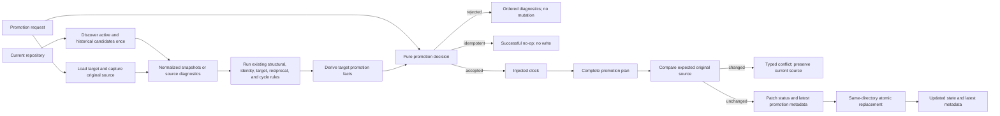

# Design

## Context And Constraints

The workspace currently provides pure structural, identity, relationship, and
cycle validation over normalized artifact snapshots. Its application layer owns
read-only source ports, and the filesystem adapter owns discovery, parsing, and
source-format concerns.

US-006 introduces one-artifact lifecycle mutation while preserving the approved
constraints:

- Promotion applies to the eight recognized artifact types and excludes release
  records.
- The lifecycle is strictly forward: `draft -> in-review -> approved ->
  implemented -> archived`, with guarded `approved -> superseded`.
- Active same-state requests are idempotent; archived, released, and already-
  superseded artifacts cannot be reopened.
- Human approval is confirmed by the surrounding workflow. Promotion records
  the supplied actor but does not classify the actor or judge approval
  authenticity.
- Failed requests are complete and atomic: no target status, content,
  promotion metadata, unrelated artifact, or unrelated file changes.
- Archival requires the artifact to have already reached its canonical archive
  location; promotion never moves files.
- The operation is deterministic, offline, and free of AI or network access.
- CLI parsing, exit codes, serialization, packet-level promotion, release
  records, and release-record promotion remain outside this slice.
- Domain code remains independent of filesystem, YAML, Markdown, Gherkin, and
  external serialization types.

## Proposed Design

Add a pure promotion policy, an application orchestration use case, and a
format-preserving filesystem mutation adapter. Existing validators and source
ports remain unchanged.

### Domain decision

Add a domain promotion capability with these value types:

- `LifecycleState` enumerates `draft`, `in-review`, `approved`, `implemented`,
  `archived`, and `superseded`. `released` is represented as an unsupported
  target for this slice rather than as a promotable state.
- `PromotionRequest` contains the requested target state and a validated,
  non-empty actor identity.
- `PromotionFacts` contains normalized results of applicable prerequisite
  checks: artifact validation, review and approval checks, implementation
  evidence, archive placement and completion conditions, and supersession
  eligibility. Facts use explicit domain states rather than unlabelled boolean
  switches.
- `PromotionPlan` contains the source state, target state, actor identity, and
  timestamp needed by the persistence boundary.
- `PromotionDecision` is one of `Accepted(PromotionPlan)`, `Idempotent`, or
  `Rejected` with ordered diagnostics.

`decide_promotion` is pure. It first handles an active same-state request as an
idempotent result, then applies the fixed transition table, terminal-state
policy, and target-specific facts. It does not read the clock, repository, or
filesystem and does not mutate the snapshot. Promotion diagnostics use the
existing domain diagnostic model and stable `ARTIFACT.PROMOTION.*` rule IDs.

For Gherkin, the domain status is read from the normalized feature status
header. For Markdown artifacts, it is read from normalized `status` metadata.
The domain policy does not know how either representation is serialized.

### Application orchestration

Add an application-owned `ArtifactPromotionStore` port and `Clock` port, plus a
`Promoter<S, P, C>` use case. The use case performs the following sequence:

1. Resolve and validate the single-artifact reference through the injected
   promotion store or the existing identity source boundary.
2. Discover the active and historical candidate set once through
   `ArtifactIdentitySource`, preserving source diagnostics and using the
   existing normalized snapshots.
3. Locate the requested artifact and run the existing structural, identity,
   target, reciprocal, and cycle domain evaluators over that one snapshot set.
   Existing public validators remain unchanged; the promotion use case consumes
   the same pure rules directly so it does not rediscover the repository.
4. Derive `PromotionFacts` for the target. Applicable diagnostics from earlier
   validation and relationship rules remain attributable to their source path.
   Packet-level promotion is not performed, but the owning tasks artifact is
   inspected for the required implementation and verification evidence.
5. Call the pure promotion policy. If it rejects, return all applicable ordered
   diagnostics and do not request a write. If it returns `Idempotent`, return a
   no-op without requesting a clock value or write.
6. Request a timestamp from the injected `Clock` for an accepted real
   transition and complete the `PromotionPlan`.
7. Ask `ArtifactPromotionStore` to commit the plan against the original source
   value. A changed source returns a typed conflict and leaves the newer source
   untouched; a write failure returns a typed operational error.
8. Return the resulting state and latest promotion metadata without exposing
   filesystem or parser types.

The use case keeps the preflight and commit phases separate. No source mutation
occurs until all applicable promotion facts pass.

### Filesystem mutation adapter

Add a concrete promotion store to the existing artifact-filesystem adapter. It
reads the target as raw text and normalized snapshot data, then applies a
format-aware patch:

- Markdown status is replaced in the existing YAML frontmatter. If promotion
  fields are absent, the four scalar fields are inserted before the closing
  separator. Existing body text, frontmatter fields, ordering, comments, and
  line endings are preserved wherever the patch does not need to change them.
- Gherkin status is replaced in the existing `# status:` header. The four
  promotion fields are added or replaced as equivalent `# promoted_*:` headers.
  Feature content and all non-promotion comments remain unchanged.
- The latest record uses `promoted_from`, `promoted_to`, `promoted_by`, and
  `promoted_at`. `promoted_at` is serialized as UTC Unix seconds.
- Before writing, the adapter compares the current raw source with the source
  captured during preflight. A mismatch returns a conflict rather than
  overwriting a concurrent change.
- The adapter writes the patched text to a temporary file in the same directory,
  flushes and closes it, then performs a same-directory atomic rename. It never
  changes directory placement and never writes an idempotent request.

The adapter maps filesystem and clock failures into application-owned typed
errors. No adapter error or parser type crosses the application port.

## Components And Responsibilities

| Component | Responsibility | Depends on |
| --- | --- | --- |
| Domain lifecycle state | Represents the supported lifecycle states and transition applicability | Standard library only |
| Domain promotion request and plan | Represents validated request data and the metadata required for one real transition | Domain lifecycle state and actor/timestamp value objects |
| Domain promotion policy | Applies transition, terminal-state, idempotency, and prerequisite rules without I/O or mutation | `ArtifactSnapshot`, `PromotionFacts`, diagnostics, and ordered domain collections |
| Domain promotion diagnostics | Creates stable, source-owned findings for invalid transitions and failed guards | Existing `Diagnostic` and `ArtifactPath` types |
| `ArtifactPromotionStore` port | Loads the target source and commits one approved plan with expected-source protection | Application-owned DTOs, domain path, and typed promotion errors |
| `Clock` port | Supplies the timestamp for a real accepted transition | Application-owned timestamp type and typed clock error |
| Promotion use case | Discovers candidates once, composes existing validation rules, derives facts, invokes the pure policy, and commits accepted plans | `ArtifactIdentitySource`, `ArtifactPromotionStore`, `Clock`, and domain evaluators |
| In-memory promotion store and clock | Provide deterministic application tests for reads, writes, conflicts, and timestamps | Application ports |
| Filesystem promotion store | Reads raw sources, applies format-aware metadata patches, detects conflicts, and atomically replaces one file | Application port, existing parser, and standard filesystem APIs |
| System clock adapter | Supplies UTC Unix seconds outside pure decision code | `Clock` port and standard library |

No new crate, workspace member, dependency, database, schema, chart, or
architectural layer is required.

## Interfaces And Contracts

| Interface | Inputs | Outputs | Errors |
| --- | --- | --- | --- |
| `domain::decide_promotion` | Target snapshot, normalized promotion facts, requested target state, actor identity, and timestamp for a proposed real transition | `Accepted(PromotionPlan)`, `Idempotent`, or ordered rejection diagnostics | No operational errors; invalid lifecycle and prerequisite states become diagnostics |
| `ArtifactPromotionStore` | One artifact reference, original source value, and an accepted promotion plan | Updated artifact state and latest promotion metadata after commit | Target not found, unreadable source, source conflict, unsupported format, and write failure as typed application errors |
| `Clock` | No external input | A UTC Unix-second promotion timestamp | Typed clock failure when a timestamp cannot be produced |
| Promotion use case | Artifact reference, target lifecycle state, actor identity, repository candidate source, promotion store, and clock | Success, active idempotent no-op, or failure with ordered diagnostics; operational failures remain typed | Repository discovery failure and store/clock failures are terminal; artifact and prerequisite failures remain complete diagnostics |
| Existing `ArtifactIdentitySource` | Current repository context held by the source | `Result<Vec<ArtifactCandidate>, ValidationError>` across active and historical canonical locations | Repository-level discovery failure; per-file failures remain candidates |
| Markdown metadata patcher | Original Markdown text, target state, latest promotion plan | Text with only permitted status and promotion metadata changes | Missing or malformed frontmatter is rejected before commit and remains unchanged |
| Gherkin header patcher | Original Gherkin text, target state, latest promotion plan | Text with only permitted status and promotion header changes | Missing or malformed status header is rejected before commit and remains unchanged |

The semantic promotion metadata contract is:

| Field | Meaning | Markdown representation | Gherkin representation |
| --- | --- | --- | --- |
| `promoted_from` | State before the real transition | Scalar frontmatter field | `# promoted_from:` header |
| `promoted_to` | State after the real transition | Scalar frontmatter field | `# promoted_to:` header |
| `promoted_by` | Supplied actor identity | Scalar frontmatter field | `# promoted_by:` header |
| `promoted_at` | UTC Unix-second timestamp of the real transition | Scalar frontmatter field | `# promoted_at:` header |

A real transition replaces the prior four-field record. An active same-state
request returns `Idempotent` and leaves the source byte-for-byte unchanged. A
rejected request never calls the commit operation.

The promotion policy applies these state rules:

| Current state | Target state | Required condition |
| --- | --- | --- |
| `draft` | `in-review` | Applicable review-entry checks pass |
| `in-review` | `approved` | Applicable approval checks pass and external human confirmation is present |
| `approved` | `implemented` | Required implementation and verification evidence is present |
| `implemented` | `archived` | Artifact is already in the canonical archive location and completion conditions pass |
| `approved` | `superseded` | An approved successor exists and required supersession links are valid |
| Active state | Same state | Return idempotent no-op without mutation |
| Any other combination | Any target | Reject as an invalid or terminal transition |

Release records and the `released` state are not accepted by this use case.

## Data And State Flow

Success, failure, and recovery behavior is explicit:

1. Repository discovery failure ends the request before mutation and returns a
   typed operational error.
2. Per-file source and parser failures remain source-owned diagnostics. A target
   that cannot be normalized is not writable.
3. The application evaluates all applicable target and prerequisite findings
   before requesting a write. Any failure returns complete ordered diagnostics.
4. An active same-state request returns a successful no-op and does not obtain a
   timestamp or touch the source.
5. An accepted real transition obtains one injected timestamp, creates one
   latest metadata record, and calls the store exactly once.
6. A source conflict or write failure leaves the original source unchanged. The
   caller corrects or reloads the repository and retries; no rollback operation
   is needed.
7. A successful commit changes only the target status and latest promotion
   metadata. Body content, unrelated artifacts, and file locations remain
   unchanged.

## Security, Performance, And Operations

- Security: Restrict reads and writes to the supplied repository's recognized
  artifact paths. Never execute artifact content, access the network, or invoke
  an AI service. Preserve source content outside the permitted metadata patch.
- Performance: Discover and parse the repository candidate set once per
  request, build validation indexes once, and read the target source once
  before the expected-source comparison. The operation is linear in repository
  candidates and relationship entries apart from existing deterministic sort
  costs; no new product runtime target is introduced.
- Atomicity: Keep preflight read-only. Use expected-source comparison and
  same-directory temporary-file replacement to prevent stale or partial writes.
  Treat conflict and write failures as terminal for that invocation.
- Operations: Return actionable diagnostics for artifact and prerequisite
  failures, and typed errors for repository, clock, conflict, and write
  failures. No cache, retry, background job, migration, or cleanup process is
  introduced.
- Compatibility: Existing `Validator`, `IdentityValidator`,
  `RelationshipValidator`, `ReciprocalRelationshipValidator`, `CycleValidator`,
  source ports, parser behavior, and report contracts remain unchanged. The new
  promoter is an opt-in mutating use case.
- Platform: Same-directory rename and source preservation are tested on the
  supported Linux and macOS environments. The exact CLI and serialization
  bindings remain deferred to EPIC-004.

## Alternatives Considered

| Alternative | Why not chosen |
| --- | --- |
| Add mutation to `ArtifactIdentitySource` | Breaks the established read-only identity contract and makes validation callers capable of writes |
| Reuse `CycleValidator` as the preflight boundary | It rediscoveries candidates and returns a complete report but does not expose the one captured source needed for an atomic commit |
| Put transition rules in the application handler | Duplicates business policy outside the pure domain and makes state-machine tests less direct |
| Rewrite full frontmatter with a YAML serializer | Changes formatting and comments outside the approved promotion metadata |
| Use a lock file as the only concurrency guard | Leaves stale locks after process failure and is less portable than expected-source comparison plus atomic replacement |
| Persist a promotion event history | Exceeds the latest-metadata-only contract and introduces an additional persistence model |
| Introduce CLI code in this slice | Violates the approved EPIC-003/EPIC-004 boundary and would make command serialization part of the library contract |

## Risks And Open Decisions

- The four flat promotion field names become a durable artifact-format contract.
  ADR-007 records that choice; future validation must treat them consistently
  across Markdown and Gherkin.
- UTC Unix seconds provide a dependency-free scalar timestamp but do not encode
  sub-second ordering. The approved story requires a timestamp, not higher
  precision; any later precision change requires a new decision.
- Existing normalized snapshots do not retain raw bytes or field locations.
  The promotion store therefore owns source-byte capture and format-aware patch
  locations, while the domain receives only normalized values.
- `implemented -> archived` depends on the external release workflow having
  relocated the packet and established completion conditions. Release-record
  authoring and promotion remain deferred; the adapter must not infer or create
  those records.
- Exact human-readable diagnostic wording, CLI syntax, exit codes, and
  machine-readable output remain deferred to EPIC-004.
- No database, schema, chart, migration, network integration, or new dependency
  is required.

## Verification Approach

- Write pure domain RED tests before implementation for every transition, active
  same-state idempotency, terminal-state rejection, unsupported `released`
  target, actor/timestamp metadata planning, all prerequisite failures, and
  deterministic diagnostic ordering. Tests cite `REQ-006` and applicable
  `FR-*` identifiers.
- Add domain property tests for transition determinism, idempotency, and stable
  diagnostic ordering using the existing `proptest` dependency.
- Write application tests with in-memory identity, promotion-store, and clock
  doubles for valid transitions, complete failure aggregation, no-write
  rejection, no-op behavior, source conflicts, typed discovery failures, clock
  failures, and unrelated-result preservation.
- Write filesystem integration tests using temporary Markdown and Gherkin
  artifacts. Verify frontmatter/header patching, latest-only replacement,
  unchanged body bytes, archive-location rejection, same-directory atomic
  replacement, source conflicts, write failures, and no file movement.
- Add acceptance coverage for all 13 approved scenario headings and every
  Scenario Outline example in `scenarios.feature`. Keep packet promotion and
  release-record behavior out of this slice.
- Verify existing active-only, identity, target, reciprocal, and cycle validator
  tests continue to pass without changed expectations.
- Run `cargo xtask ci`, `cargo machete`, and the available fuzz-target smoke
  check; record observed output in `tasks.md` during implementation and
  verification.
- Verify dependency direction, constructor injection, typed errors, public
  documentation, no unsafe code, no new dependency, no unapproved lint
  suppression, and all Rust coverage thresholds from `CONSTITUTION.md`.

## Traceability

- Source story: `US-006`.
- Parent epic: `EPIC-003`.
- Parent PRD: `PRD-001`.
- Approved requirements: `REQ-006`.
- Lifecycle authority: `ADR-002`.
- Layering and parser boundary: `ADR-005`.
- Historical discovery boundary: `ADR-006`.
- Atomic promotion boundary and metadata format: `ADR-007`.
- Preceding validation design: `DES-005`.
- Executable scenarios: `scenarios.feature`.
- Functional coverage: `REQ-006` FR-001 through FR-015.
