# Design

## Context And Constraints

US-007 builds on the single-artifact promotion capability from US-006. The
workspace already has:

- pure domain lifecycle state and single-artifact promotion policy;
- application-owned read and write ports for repository discovery, source
  capture, promotion commits, and time;
- a filesystem adapter that patches Markdown frontmatter and Gherkin headers
  while preserving non-promotion content;
- structural, identity, relationship, reciprocal, and cycle validators over
  normalized artifact snapshots.

The packet promotion slice adds multi-artifact planning and all-or-nothing
mutation while preserving the approved constraints:

- The request is one packet step; no caller-supplied packet-level target state is
  accepted.
- Colocated packet artifacts and implementation-packet supporting artifacts are
  considered together.
- Reachable artifacts outside the implementation packet context, including
  parent PRDs and epic briefs by default, are excluded.
- Each advanceable artifact moves to its own next valid state.
- Included artifacts with no next valid state are reported as skipped and are not
  errors.
- Any failed prerequisite for an artifact selected to advance fails the whole
  request without mutation.
- Successful mutation changes only advancing artifact status and latest
  promotion metadata.
- CLI parsing, exit codes, machine-readable serialization, release records,
  archive relocation, and Spec-Ready evaluation remain outside this slice.
- Domain code remains independent of filesystem, YAML, Markdown, Gherkin,
  clocks, and external serialization types.

No new crate, dependency, database, schema, chart, architectural layer, or ADR is
required. This design reuses and extends the atomic promotion boundary recorded
in `ADR-007` without changing the durable promotion metadata format.

## Proposed Design

Add a pure packet-promotion planner, an application packet promotion use case,
and a batch commit operation at the promotion store boundary.

### Domain packet planning

Introduce domain packet-promotion value types:

- `ImplementationPacketRef` identifies the packet directory in normalized,
  repository-relative terms.
- `PacketParticipant` represents an included artifact snapshot and its role:
  colocated packet artifact or implementation-packet supporting artifact.
- `PacketPromotionStep` is one of `Advance { source, target }` or `Skip`.
- `PacketPromotionPlan` contains ordered artifact-level promotion plans and
  ordered skipped participants.
- `PacketPromotionDecision` is `Accepted(PacketPromotionPlan)` or
  `Rejected(Vec<Diagnostic>)`.
- `PacketPromotionFacts` carries per-artifact prerequisite facts keyed by
  artifact ID where present and artifact kind/type where no artifact ID exists.

The pure planner receives normalized snapshots, relationship diagnostics,
validation diagnostics, a packet reference, actor identity, per-artifact facts,
and one proposed timestamp. It performs no I/O and does not mutate snapshots.

The planner performs these decisions in order:

1. Resolve the packet's colocated artifacts from canonical paths.
2. Resolve implementation-packet supporting artifacts directly and recursively
   through `requires`, `depends_on`, and `related`, stopping when a reachable
   artifact is outside the implementation packet context.
3. Exclude parent PRDs and epic briefs unless they are explicitly classified as
   implementation-packet supporting artifacts.
4. Derive each included artifact's next valid lifecycle target:
   `draft -> in-review`, `in-review -> approved`, `approved -> implemented`,
   and `implemented -> archived` only when applicable; guarded supersession is
   not derived implicitly for a packet step.
5. Mark artifacts without a valid next state as skipped participants.
6. For each advanceable artifact, call the existing single-artifact promotion
   policy with the artifact-specific facts and derived target.
7. Aggregate every rejection diagnostic in deterministic order. If any selected
   artifact rejects, return no artifact plans.
8. If every selected artifact accepts, return ordered advancement plans and
   ordered skipped participants.

The all-skipped/zero-advance result is a successful no-op packet promotion. The
result reports every included artifact as skipped and performs no writes.

### Application orchestration

Add a `PacketPromoter<S, P, C>` use case in the application crate. It uses the
existing `ArtifactIdentitySource` for repository-wide discovery, an extended
promotion store port for batch source capture and commit, and the existing
`Clock` port.

The use case sequence is:

1. Accept a `PromotePacketCommand` containing the packet reference, actor
   identity, and per-artifact confirmations/facts keyed by artifact ID or
   artifact type.
2. Discover active and historical candidates once through `ArtifactIdentitySource`.
3. Normalize source-owned candidate diagnostics and collect snapshots.
4. Run existing structural, relationship, reciprocal, and cycle rules over the
   same snapshot set.
5. Load raw sources for candidate artifacts that may advance, using the store
   before commit planning so expected-source protection is available.
6. Build packet participant facts from validation results, relationship results,
   blockers, evidence markers, archive placement, confirmations, and
   implementation-packet context classification.
7. Request one timestamp from the injected clock for the packet operation.
8. Invoke the pure packet planner. If rejected, return diagnostics and do not
   call commit.
9. If accepted with advancing plans, call the promotion store batch commit once.
10. Return advanced and skipped participants. Store conflicts and write failures
    become typed operational errors and leave the repository unchanged.

The handler remains orchestration-only. It does not compute lifecycle rules
outside the domain planner and does not expose parser or filesystem error types.

### Batch filesystem commit

Extend the existing filesystem promotion adapter with a batch commit method. The
batch operation uses the same patchers and metadata fields as single-artifact
promotion:

- `promoted_from`
- `promoted_to`
- `promoted_by`
- `promoted_at`

The batch commit performs these phases:

1. Read the current source for every advancing artifact.
2. Compare every current source with its expected preflight source.
3. If any source differs, return a conflict before writing any file.
4. Patch every artifact in memory, rejecting unsupported or malformed formats
   before writing any file.
5. Write temporary files in each target's directory.
6. Replace targets with same-directory atomic renames.
7. If a write or rename fails after any target was replaced, restore replaced
   targets from captured original bytes where possible and report a typed write
   failure.

The restore path is best-effort recovery for process-local write failures. The
contract still treats the batch as failed and reports that no promotion should be
considered committed unless every replacement succeeds. Tests verify common
failure points and source preservation. Skipped and excluded artifacts are never
loaded for write and never patched.

## Components And Responsibilities

| Component | Responsibility | Depends on |
| --- | --- | --- |
| Domain packet reference and participant types | Represent a canonical implementation packet and ordered included participants | Existing `ArtifactPath`, `ArtifactKind`, and `ArtifactSnapshot` types |
| Domain packet step derivation | Derive each included artifact's next lifecycle state or skipped result | Existing `LifecycleState` and single-artifact transition rules |
| Domain packet inclusion policy | Include colocated artifacts and implementation-packet supporting artifacts; exclude outside context and parents by default | Normalized metadata relationships and artifact kinds |
| Domain packet planner | Aggregate participant selection, next-state planning, per-artifact promotion decisions, skipped participants, and deterministic diagnostics | Existing `decide_promotion`, diagnostics, and normalized snapshots |
| `PromotePacketCommand` | Carry packet reference, actor identity, and per-artifact facts keyed by ID or type | Application DTOs and domain value types |
| `PacketPromoter` use case | Discover candidates once, derive facts, invoke packet planner, and request one batch commit | `ArtifactIdentitySource`, packet promotion store, `Clock`, and domain rules |
| Batch promotion store port | Capture expected raw sources and commit accepted artifact plans as one batch | Application-owned source DTOs, domain plans, typed promotion errors |
| In-memory packet promotion store and clock | Provide deterministic application tests for accepted, rejected, skipped, and conflict paths | Application ports |
| Filesystem batch promotion store | Compare expected sources, patch all artifacts, atomically replace advancing files, and recover from write failures where possible | Application port, existing patchers, standard filesystem APIs |

## Interfaces And Contracts

| Interface | Inputs | Outputs | Errors |
| --- | --- | --- | --- |
| `domain::plan_packet_promotion` | Packet reference, normalized snapshots, per-artifact facts, actor identity, and timestamp | Accepted packet plan with advanced and skipped participants, or ordered rejection diagnostics | No operational errors; invalid packet or prerequisite states become diagnostics |
| `PromotePacketCommand` | Packet path, actor identity, per-artifact confirmations/facts keyed by artifact ID or artifact type | Application command consumed by packet promoter | Actor validation errors before command construction |
| `PacketPromoter` | Command, repository candidate source, packet promotion store, and clock | Success with advanced/skipped participants, rejection diagnostics, or typed operational failure | Discovery, clock, source load, source conflict, unsupported format, and write failures |
| Batch promotion store | Expected source set and accepted artifact plans | Updated source records for every advanced artifact | Target not found, unreadable source, source conflict, unsupported format, write failure, and recovery failure as typed errors |
| Filesystem patchers | Original Markdown or Gherkin text and one artifact promotion plan | Patched text with only status and promotion metadata changes | Missing status/frontmatter/header or unsupported format |

Participant result contract:

| Result kind | Meaning | Mutation |
| --- | --- | --- |
| Advanced | Included artifact had a next valid state and passed every prerequisite | Status and latest promotion metadata updated |
| Skipped | Included artifact could not advance one next valid state | No mutation and no new promotion metadata |
| Excluded | Reachable artifact was outside implementation packet context | Not reported as advanced or skipped and not mutated |

Per-artifact fact matching contract:

| Key kind | Applies to |
| --- | --- |
| Artifact ID | The one artifact with that normalized ID, such as `US-007`, `REQ-007`, or `ADR-007` |
| Artifact type | Artifacts of that kind when no more-specific artifact ID fact is supplied; Gherkin uses its artifact type because it has no own ID |

Artifact ID facts take precedence over artifact type facts. Missing required
confirmation for a selected artifact is a packet-level failure, not a skipped
result.

## Data And State Flow

```mermaid
flowchart LR
    REQUEST["Packet promotion request"] --> DISCOVER["Discover candidates once"]
    DISCOVER --> SNAPSHOTS["Normalized snapshots and source diagnostics"]
    SNAPSHOTS --> VALIDATE["Run structural, relationship, reciprocal, and cycle rules"]
    VALIDATE --> INCLUDE["Resolve packet participants"]
    INCLUDE --> FACTS["Build per-artifact promotion facts"]
    FACTS --> CLOCK["Injected clock"]
    CLOCK --> PLAN["Pure packet planner"]
    PLAN -->|"rejected"| DIAGS["Ordered diagnostics; no mutation"]
    PLAN -->|"accepted"| LOAD["Load expected sources for advancing artifacts"]
    LOAD --> COMPARE["Compare every expected source"]
    COMPARE -->|"conflict"| CONFLICT["Typed conflict; no mutation"]
    COMPARE --> PATCH["Patch all advancing artifacts in memory"]
    PATCH --> WRITE["Batch temp-write and atomic replace"]
    WRITE --> RESULT["Advanced and skipped participants"]
```

Failure and recovery behavior:

1. Repository discovery failure stops before mutation and returns a typed error.
2. Source diagnostics attached to candidates become prerequisite diagnostics for
   affected selected artifacts.
3. Missing confirmations, blockers, invalid relationships, missing evidence, and
   unsupported lifecycle transitions are all evaluated before any commit.
4. Skipped artifacts are retained in the accepted packet plan and are never
   written.
5. A source conflict for any advancing artifact fails the batch before writing.
6. Unsupported source format for any advancing artifact fails the batch before
   writing.
7. A write failure after replacement triggers best-effort restoration of any
   replaced targets and returns a typed write failure.
8. A successful batch commit changes only advancing artifacts.

## Security, Performance, And Operations

- Security: Restrict reads and writes to recognized artifact paths under the
  repository `specs/` tree. Never execute artifact content, access the network,
  or invoke an AI service. Preserve content outside approved metadata fields.
- Performance: Discover candidates once, build relationship indexes once, and
  patch only advancing artifacts. The operation is linear in candidate and
  relationship count apart from existing deterministic sort costs.
- Atomicity: Keep preflight read-only. Compare every expected source before any
  write, stage all patches before replacement, and recover replaced files on
  process-local write failures where possible.
- Operations: Return actionable diagnostics for domain/prerequisite failures and
  typed errors for discovery, clock, conflict, unsupported format, write, and
  recovery failures. No cache, background job, retry loop, migration, or cleanup
  process is introduced.
- Compatibility: Existing single-artifact promotion, validators, source ports,
  parser behavior, reports, and metadata format remain compatible. Packet
  promotion is an additional opt-in use case.

## Alternatives Considered

| Alternative | Why not chosen |
| --- | --- |
| Sequentially call the single-artifact promoter and stop on first failure | Can leave earlier artifacts promoted when a later artifact fails, violating packet atomicity |
| Require every included artifact to promote to the same target state | Contradicts the approved one-step behavior where each artifact advances to its own next valid state |
| Treat non-advanceable included artifacts as errors | Contradicts the approved skipped participant behavior |
| Include every reachable relationship recursively | Pulls unrelated PRDs, epics, and artifacts into packet promotion and violates the implementation-packet context boundary |
| Create a new database or promotion transaction log | Exceeds the repository-file persistence model and adds out-of-scope infrastructure |
| Add a new adapter crate for packet promotion | The existing filesystem promotion adapter already owns source patching and commit behavior |
| Change promotion metadata to store packet-level history | Contradicts `ADR-007` latest-record metadata and expands persistence scope |

## Risks And Open Decisions

- The exact classification of "implementation-packet supporting artifact" must
  be encoded carefully so recursive inclusion does not accidentally include
  parent PRDs, epics, or unrelated artifacts.
- Cross-file atomicity on a plain filesystem cannot be guaranteed across process
  crashes between renames. The design provides preflight conflict prevention,
  same-directory atomic replacement for each file, and best-effort in-process
  recovery. Stronger crash-proof multi-file transactions would require a new
  persistence model and is out of scope.
- The all-skipped/zero-advance path must remain a successful no-op with skipped
  participants and no writes; tests should distinguish it from failure.
- Per-artifact fact precedence between artifact ID and artifact type is defined
  here; future CLI serialization remains deferred to EPIC-004.
- Packet-level supersession is not derived implicitly. Guarded supersession and
  release-record behavior remain separate lifecycle concerns.

## Verification Approach

- Write pure domain RED tests for packet participant inclusion, recursive
  implementation-packet support traversal, parent PRD/epic exclusion, outside
  context exclusion, next-state derivation, skipped participants, per-artifact
  fact matching, failure aggregation, deterministic ordering, and accepted plan
  ordering.
- Add domain property tests for deterministic packet planning under reordered
  snapshots and repeated identical inputs.
- Write application tests with in-memory candidate source, packet promotion
  store, and clock for one discovery pass, accepted mixed-state packet plans,
  skipped participant results, missing confirmation failures, complete
  diagnostic aggregation, no-write rejection, source conflict failures, and
  clock/store call behavior.
- Write filesystem adapter tests using temporary repositories for batch Markdown
  and Gherkin patching, expected-source conflict before write, unsupported
  format before write, skipped artifact preservation, unrelated file
  preservation, rollback/recovery on write failure, and no file movement.
- Add scenario-equivalent tests for every approved `US-007` scenario heading.
- Verify existing single-artifact promotion and validator tests remain green
  without changed expectations.
- Run `cargo xtask ci`, `cargo machete`, fuzz manifest checks, and available
  parser fuzz smoke checks during implementation verification. Record observed
  output in `tasks.md` through the `verify-feature` workflow.

## Traceability

- Source story: `US-007`.
- Approved requirements: `REQ-007`.
- Parent epic: `EPIC-003`.
- Parent PRD: `PRD-001`.
- Single-artifact promotion design: `DES-006`.
- Lifecycle authority: `ADR-002`.
- Atomic promotion metadata and persistence boundary: `ADR-007`.
- Executable scenarios: `scenarios.feature`.
- Functional coverage: `REQ-007` FR-001 through FR-015.
