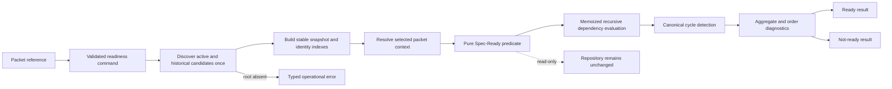

# Design

## Context And Constraints

US-008 adds a read-only Spec-Ready evaluation to the existing Rust validation
workspace. The workspace already provides:

- pure normalized artifact snapshots, metadata, document structure, diagnostics,
  and deterministic reports in `crates/domain`;
- structural, identity, target, reciprocal, and relationship-cycle validators;
- implementation-packet references and bounded packet-context traversal;
- an application-owned `ArtifactIdentitySource` for active and historical
  repository discovery;
- filesystem parsing that preserves source diagnostics and normalized Markdown
  and Gherkin structure.

The approved contract adds two capabilities not currently represented by the
model:

- Gherkin scenario names must provide the four exact coverage prefixes
  `Happy:`, `Alternate:`, `Failure:`, and `Boundary:`.
- Database and table schema documents must be recognized as `DB-NNN` and
  `TABLE-NNN` artifacts, including their bidirectional links.

ADR-008 records the deliberate expansion of schema-artifact recognition that was
previously deferred by EPIC-002. This slice does not create a runtime database,
perform migrations, or persist readiness results.

The design preserves the existing constraints:

- domain code remains synchronous, pure, deterministic, and free of filesystem,
  parser, serialization, and application-port dependencies;
- application code orchestrates discovery and maps operational failures into
  typed errors;
- adapters parse repository files and implement existing ports;
- no new crate, workspace member, external dependency, unsafe code, CLI
  serialization, release behavior, or file mutation is introduced;
- readiness is a read-only observation and never changes lifecycle status.

## Proposed Design

### Normalized artifact and schema model

Extend the existing `ArtifactKind` model with `Database` and `Table` kinds:

- `ArtifactKind::Database` maps to `specs/schema/DB-NNN.md`, uses the
  `database-schema` type, and carries a `DB-NNN` identity.
- `ArtifactKind::Table` maps to `specs/schema/TABLE-NNN.md`, uses the
  `table-schema` type, and carries a `TABLE-NNN` identity.
- Both kinds participate in stable kind ordering, path identity checks,
  duplicate-ID checks, and recognized filesystem discovery.
- Existing generic YAML frontmatter and Markdown parsing is reused. Schema
  rules add the required frontmatter fields and headings from the approved
  database and table templates.
- Database metadata requires a `tables` sequence. Table metadata requires a
  scalar `database` reference. A table's `database: DB-NNN` must be present in
  the target database's `tables` membership, and every database table entry must
  resolve to a table that points back to that database.
- Schema target and link diagnostics remain read-only findings. They are
  composed into readiness diagnostics for supporting schema artifacts.

The schema model is document metadata only. It does not introduce a database
connection, SQL execution, migration runner, or persistence port.

### Gherkin coverage model

Extend the normalized `FeatureSnapshot` with a deterministic set of scenario
coverage categories. The filesystem parser already receives the parsed Gherkin
AST, so it will inspect each scenario name and classify only exact,
case-sensitive prefixes:

- `Happy:` → happy-path coverage;
- `Alternate:` → alternate-path coverage;
- `Failure:` → failure-path coverage;
- `Boundary:` → boundary-path coverage.

A scenario without one of these prefixes remains valid Gherkin but contributes
no Spec-Ready category. The pure readiness rule reports a missing-category
 diagnostic for every absent category. Scenario names and category membership
are retained in normalized domain data rather than re-reading source text in the
application layer.

### Pure readiness evaluation

Add a `readiness` capability to `crates/domain`. It receives an immutable,
repository-wide set of normalized snapshots and an `ImplementationPacketRef`,
then returns a decision value without I/O:

- `Ready(SpecReadyResult)` when every applicable predicate passes;
- `NotReady(SpecReadyResult)` when one or more applicable conditions fail.

`SpecReadyResult` contains the selected packet reference, deterministic
included/context paths, and ordered diagnostics. It does not contain wire-format
or CLI serialization types.

The evaluator builds a stable index by path, artifact ID, packet directory, and
artifact kind. It separates three scopes:

1. **Selected packet scope:** the five colocated artifacts and supporting ADR,
   database, and table artifacts reached through implementation-packet context
   relationships.
2. **Prerequisite context:** the selected packet's parent PRD and epic brief,
   plus resolved supporting targets needed to evaluate status and links. These
   artifacts are checked but are not reported as packet participants.
3. **Dependency packet scope:** packet roots reached through feature-story
   `depends_on` references. Each root is recursively evaluated once.

The evaluator applies the predicate in a stable order:

1. confirm all five selected packet paths are present and have exactly
   `approved` lifecycle state;
2. validate the selected packet's structural findings and Gherkin category set;
3. resolve and check the approved parent PRD and epic brief;
4. resolve supporting ADR/schema targets and check status, identities,
   relationships, and database/table reciprocity;
5. check the selected packet's complete requirements, design, task evidence,
   blockers, and cross-references;
6. recursively evaluate feature dependencies, requiring each dependency packet
   to be `implemented` and to contain valid recorded implementation and
   verification evidence;
7. detect dependency cycles and add one diagnostic per distinct canonical cycle;
8. aggregate and sort every finding by stable path, rule identifier, location,
   and message before classifying the result.

A dependency packet's own artifacts are evaluated under its implementation
contract: all five packet artifacts must be `implemented`, its `tasks.md` must
contain the recorded verification evidence section, and its recursive feature
dependencies must satisfy the same dependency rule. It is not required to remain
in the pre-implementation `approved` state.

Shared packet roots use memoized results keyed by canonical packet directory.
Active recursion uses a separate visiting set. Encountering a visiting root
creates one canonical cycle identity and stops that branch; the completed result
is then reused for other paths.

Existing validators remain the source of structural, identity, target,
reciprocal, and general relationship findings. Readiness adds only the
packet-scope, exact-state, scenario-category, schema-link, evidence, and
feature-dependency rules that are specific to this contract. Findings from
unrelated repository artifacts are not copied into the result.

### Application orchestration

Add an application `SpecReadyEvaluator<S>` use case and an
`EvaluateSpecReadyCommand`:

- the command carries one `ImplementationPacketRef`;
- the evaluator receives an injected `ArtifactIdentitySource`;
- discovery occurs exactly once;
- if no selected packet artifact is discovered for a syntactically valid root,
  the evaluator returns a typed operational `PacketNotFound` error;
- source diagnostics and snapshots are passed to the pure domain evaluator;
- domain `Ready` and `NotReady` decisions are returned as successful outcomes;
- discovery failures remain typed operational errors.

Syntactically invalid packet paths continue to fail at
`ImplementationPacketRef::try_new`. The application error distinguishes a
missing root packet from a valid packet that fails readiness. No filesystem
path type, parser error, or adapter type crosses the application boundary.

The application use case does not write, call a clock, invoke promotion, or
serialize a result. It composes the existing source port and pure rules only.

### Schema validation integration

The existing domain validators are extended at their normalized boundaries:

- path/ID identity recognizes database and table filenames;
- structural rules recognize the template-required metadata and headings;
- relationship target rules recognize `database: DB-NNN` and database `tables`
  entries;
- a focused schema-link rule checks bidirectional DB/TABLE membership;
- stable artifact ordering includes the two new kinds without changing the
  ordering of existing kinds.

These changes keep parser-specific YAML handling in the artifact-filesystem
adapter and keep schema semantics in the domain. The readiness evaluator uses
schema findings only for schema artifacts in its selected supporting context.

## Components And Responsibilities

| Component | Responsibility | Depends on |
| --- | --- | --- |
| `ArtifactKind::Database` and `ArtifactKind::Table` | Represent recognized SDD schema documents and canonical paths | Existing artifact identity and path types |
| Schema structural rules | Validate schema metadata, headings, and lifecycle fields | Existing normalized metadata/document model |
| Schema-link validator | Validate database/table target kinds and bidirectional membership | Normalized snapshots and relationship identifiers |
| `FeatureSnapshot` coverage data | Preserve scenario-name category coverage at the parser boundary | Existing Gherkin parser and domain document model |
| Domain readiness scope index | Index snapshots by path, ID, kind, and packet root; separate selected, prerequisite, and dependency scopes | Existing snapshots and packet references |
| Domain readiness evaluator | Apply the Spec-Ready predicate, recurse dependencies, deduplicate shared roots, detect cycles, and order diagnostics | Structural/identity/relationship rules and readiness-specific rules |
| `EvaluateSpecReadyCommand` | Carry one validated packet reference | Domain packet reference |
| `SpecReadyEvaluator` | Discover candidates once and translate source failures into typed application errors | `ArtifactIdentitySource` and domain evaluator |
| Readiness result types | Expose ready/not-ready classification, evaluated scope, and ordered diagnostics | Domain value types |
| In-memory readiness source | Provide deterministic application tests without filesystem access | Existing application test-double pattern |
| Filesystem parser/discovery extension | Recognize DB/TABLE paths and derive Gherkin coverage data | Existing artifact-filesystem parser and source |

## Interfaces And Contracts

| Interface | Inputs | Outputs | Errors |
| --- | --- | --- | --- |
| `domain::evaluate_spec_ready` | One `ImplementationPacketRef` and immutable normalized snapshots | `Ready(SpecReadyResult)` or `NotReady(SpecReadyResult)` | No operational errors; unresolved content becomes deterministic diagnostics |
| `EvaluateSpecReadyCommand` | One repository-relative packet reference | A command containing a validated `ImplementationPacketRef` | Invalid path/reference error at construction |
| `SpecReadyEvaluator` | Command and injected `ArtifactIdentitySource` | Successful readiness decision or typed `ReadinessError` | Discovery failure or missing root packet |
| Gherkin parser coverage extraction | Parsed feature and scenario names | `FeatureSnapshot` with category membership | Malformed Gherkin remains a parser diagnostic and cannot satisfy readiness |
| Schema-link validator | Normalized DB/TABLE snapshots | Ordered schema-link diagnostics | Missing, wrong-kind, malformed, or non-reciprocal links become findings |
| Readiness result | Packet reference, evaluated scope, classification, diagnostics | Stable domain result for callers | No serialization or CLI-specific representation |

Diagnostic contracts:

- A missing root packet is an operational `ReadinessError`, not a not-ready
  result.
- A present but incomplete packet produces a not-ready result and continues
  collecting applicable findings.
- Missing scenario categories identify the exact missing prefixes.
- Dependency cycles identify one canonical cycle identity per distinct cycle.
- Diagnostics are sorted deterministically by path, rule identifier, location,
  and message using the existing diagnostic ordering conventions.

## Data And State Flow

State and recovery behavior:

1. Command construction validates the repository-relative packet reference.
2. Discovery produces snapshots and source diagnostics without mutation.
3. A root with no selected packet artifact returns `PacketNotFound`.
4. A valid root enters pure scope resolution and predicate evaluation.
5. All branches are evaluated with memoization and active-cycle tracking.
6. A ready or not-ready result returns without a write phase, rollback, clock,
   or recovery operation.
7. Repeating the same request against unchanged snapshots returns an equal result.

## Security, Performance, And Operations

- **Security:** Restrict evaluation to repository-relative `specs/` paths. Never
  execute SQL from schema documents, interpret artifact content as code, access
  the network, or invoke an AI service. No source bytes are written.
- **Performance:** Discover once, build B-tree indexes once, memoize each
  dependency packet once, and sort only the collected diagnostics. Evaluation is
  linear in the discovered snapshot and relationship counts plus deterministic
  cycle traversal and sorting.
- **Operational errors:** Use application-owned typed errors for discovery and
  missing-root failures. Keep valid not-ready findings in the normal result
  path so callers can correct every issue in one pass.
- **Compatibility:** Preserve existing validator and promotion APIs. Existing
  repositories without schema artifacts continue to validate as before; schema
  paths become recognized only under their canonical `specs/schema/` locations.
- **Migration:** No runtime data migration is required. The change adds
  document recognition and validation only. Existing active artifacts are not
  rewritten.
- **Observability:** The result exposes stable paths and rule identifiers. CLI
  formatting and machine-readable serialization remain deferred to EPIC-004.

## Alternatives Considered

| Alternative | Why not chosen |
| --- | --- |
| Defer DB/TABLE recognition until a later epic | Explicitly rejected for this slice; the approved Spec-Ready contract requires schema support and the user authorized the expansion |
| Add a separate schema crate or parser subsystem | Adds a new architectural layer and dependency without need; existing normalized artifact and Markdown boundaries are sufficient |
| Infer scenario categories from arbitrary keywords | Produces ambiguous classifications; exact prefix labels are deterministic and approved |
| Require Gherkin tags instead of name prefixes | Changes the approved behavior after the user selected the name-prefix convention |
| Re-evaluate shared dependency packets for every path | Duplicates findings and makes cycle behavior path-dependent; memoization gives one stable result |
| Treat implemented dependencies as pre-implementation approved packets | Conflicts with the approved rule that implemented dependencies satisfy dependency readiness |
| Persist a readiness status in frontmatter | Violates the read-only contract and would create a second lifecycle status |
| Add a readiness-specific filesystem write port | No writes occur; the existing read-only identity source is sufficient |

## Risks And Open Decisions

- Adding DB/TABLE kinds expands the recognized artifact set and requires updates
  to kind ordering, identity, structural rules, relationship target policies,
  and their compatibility tests.
- Existing schema templates contain illustrative `TBD` values. They remain
  templates and are excluded from active discovery; only canonical active schema
  documents participate in readiness.
- The current normalized Gherkin model has only aggregate step presence. Adding
  category membership must preserve existing parser behavior and malformed-file
  diagnostics.
- The exact definition of valid dependency verification evidence is the
  recorded verification section and passing evidence in the dependency's
  `tasks.md`; task implementation must test missing and malformed evidence.
- Cross-process filesystem mutation is irrelevant because this use case is
  read-only; no locking or transaction mechanism is introduced.
- CLI exit codes and serialized result formats remain deferred to EPIC-004.

## Verification Approach

- **Domain RED/GREEN tests:** Add tests before implementation for schema kinds,
  canonical paths, identity ordering, DB/TABLE link validation, scenario prefix
  extraction, exact approved-state checks, complete predicate success,
  aggregate failures, dependency recursion, shared-root memoization, cycle
  diagnostics, missing evidence, and deterministic output.
- **Property tests:** Prove readiness result equality for reordered snapshots,
  stable diagnostic ordering, dependency memoization, and cycle termination.
- **Application tests:** Use an in-memory `ArtifactIdentitySource` to verify one
  discovery call, missing-root typed errors, ready/not-ready outcomes, source
  diagnostic preservation, and read-only behavior.
- **Adapter integration tests:** Use temporary repositories to discover DB/TABLE
  documents, parse their frontmatter and headings, parse scenario prefixes, and
  preserve existing discovery exclusions.
- **Scenario-equivalent acceptance tests:** Cover every approved US-008 scenario
  heading, including the invalid-reference operational error and repeated
  evaluation behavior.
- **Quality gates:** Run `cargo xtask ci`, `cargo machete`, fuzz manifest and
  available parser fuzz checks, and record observed output through
  `verify-feature`. No .NET or frontend gates apply.

## Traceability

- Source story: `US-008`.
- Approved requirements: `REQ-008`.
- Executable scenarios: `specs/008-evaluate-spec-ready-status/scenarios.feature`.
- Parent epic: `EPIC-003`.
- Parent PRD: `PRD-001`.
- Packet-context design: `DES-007`.
- Lifecycle authority: `ADR-002`.
- Existing promotion/application boundary: `ADR-007`.
- Schema and scenario-model decision: `ADR-008`.
- Functional coverage: `REQ-008` FR-001 through FR-013.
