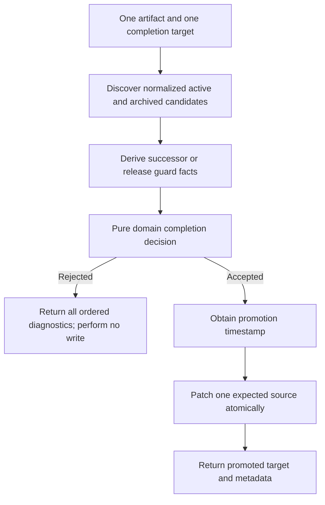

# Design

## Context And Constraints

US-009 extends the existing Rust promotion capability with three guarded
completion outcomes: superseding an approved artifact, releasing an approved
release record, and archiving an implemented feature packet that has already
been relocated by `record-release`.

The existing workspace already provides:

- pure domain lifecycle and promotion decisions;
- application-owned source, clock, single-artifact-store, and packet-store
  ports;
- deterministic structural, identity, relationship, reciprocity, and cycle
  validation;
- format-preserving atomic Markdown and Gherkin promotion stores; and
- atomic packet promotion with expected-source conflict checks.

The design preserves those boundaries and adds no crate, dependency,
architectural layer, file-movement operation, release-record creation, SQL
execution, network access, or AI judgment. `record-release` remains responsible
for creating release records and moving completed packets into
`specs/archive/`.

The current normalized model does not yet recognize `REL-NNN` release records,
the `released` lifecycle state, or relocated packet references. ADR-009 records
the decision to add those representations at the existing domain and parser
boundaries.

## Proposed Design

Extend the existing promotion flow rather than introducing a second lifecycle
authority:

1. Recognize release records at `specs/releases/REL-NNN.md` as a first-class
   normalized artifact kind. Parse their included-feature rows, verification
   evidence, and release commit into a normalized release document snapshot.
2. Add `released` to the normalized lifecycle state while preserving the
   existing strict forward-transition policy and terminal-state behavior.
3. Derive completion prerequisite facts from the immutable discovered snapshot
   set. The domain evaluates successor reciprocity, release closure, archive
   location, release-record association, structural findings, and existing
   relationship findings before any clock or write operation is used.
4. Reuse the single-artifact promotion path for supersession and release
   records. Reuse the packet path for archival, but add a dedicated archival
   planner that selects only the five colocated packet artifacts; supporting
   ADRs are never archived as a side effect.
5. Extend `ImplementationPacketRef` to accept both active packet directories
   and relocated `specs/archive/NNN-feature-slug/` directories. The existing
   identity source already scans archived paths for identity-aware operations.
6. Preserve the existing format-preserving stores. Successful operations patch
   lifecycle and promotion metadata only; failed preflight performs no write,
   and source conflicts remain typed operational errors.

The release-record association uses the normalized `US-NNN` user-story ID in
an included-feature row. An archival request succeeds only when a structurally
valid `released` record includes that story ID and reports its feature as
`implemented` or `archived`.

## Components And Responsibilities

| Component | Responsibility | Depends on |
| --- | --- | --- |
| `domain::ArtifactKind` and lifecycle values | Recognize `Release` artifacts, `REL-NNN` identities, canonical release paths, and `released` state | Existing artifact and promotion value objects |
| Normalized release document snapshot | Carry included user-story/status rows, verification-evidence presence, and release-commit presence without serialization types | Existing `DocumentSnapshot` and parser boundary |
| Pure completion policy | Validate one target and one completion transition, aggregate all applicable guards, and return accepted or rejected decisions deterministically | Existing `PromotionFacts`, `PromotionDecision`, relationship validators, and packet planning |
| Supersession evaluator | Resolve an approved successor and validate reciprocal links for an approved predecessor | Existing identity and reciprocal relationship rules |
| Release evaluator | Validate release-record structure, included feature states, verification evidence, and release commit | Normalized release snapshot and artifact validation |
| Packet archival planner | Validate relocated packet and released-record association, then plan only the five colocated artifacts for `archived` | `ImplementationPacketRef`, packet participants, and pure promotion policy |
| Application single-artifact promoter | Discover once, load expected source, derive completion facts, obtain time only after acceptance, and commit one artifact | `ArtifactIdentitySource`, `ArtifactPromotionStore`, `Clock` |
| Application packet promoter | Discover once, validate one packet target, build the archival plan, load all expected sources, and commit atomically | `ArtifactIdentitySource`, `ArtifactPacketPromotionStore`, `Clock` |
| Filesystem artifact source and parser | Discover canonical release files and archived packet files and populate normalized snapshots | Existing filesystem and parser crates |
| Filesystem promotion stores | Patch status and latest promotion metadata atomically without moving files | Existing standard-library filesystem implementation |

## Interfaces And Contracts

| Interface | Inputs | Outputs | Errors |
| --- | --- | --- | --- |
| Pure single-artifact completion decision | One normalized snapshot, immutable repository snapshots, target state, actor, and supplied timestamp | `PromotionDecision::Accepted`, `Idempotent`, or ordered `Rejected` diagnostics | No I/O errors; all prerequisite failures are domain diagnostics |
| Pure packet archival plan | One active or archived `ImplementationPacketRef`, normalized snapshots, actor, and supplied timestamp | An atomic plan for the five colocated artifacts or ordered diagnostics | No I/O errors; missing packet artifacts, invalid release association, lifecycle failures, and structural findings are diagnostics |
| `PromoteArtifactCommand` | One artifact path, one target state, and actor identity | Successful `PromotionOutcome` or complete rejected diagnostics | Existing typed discovery, source, clock, conflict, format, and write errors |
| `PromotePacketCommand` archival operation | One packet directory and actor identity | Successful packet result for the five archived artifacts or complete rejected diagnostics | Existing typed discovery, source, clock, conflict, format, and write errors |
| `ArtifactIdentitySource` | Repository root | Active and archived recognized candidates, including source diagnostics | Existing typed discovery failure |
| `ArtifactPromotionStore` | Expected source and one accepted plan | Atomically patched source artifact | Existing source, conflict, unsupported-format, and write errors |
| `ArtifactPacketPromotionStore` | Expected sources and all accepted archival plans | Atomically patched packet sources | Existing batch source, conflict, unsupported-format, and write errors |

The existing ports remain the process-boundary seams. No filesystem or parser
type crosses into the domain or application decision contracts.

## Data And State Flow

A successful single-artifact completion follows this flow:

Archival follows the same preflight boundary but plans one logical packet:

1. Discover the repository once, including archived paths.
2. Resolve the packet's five colocated artifacts and its user-story identity.
3. Resolve a structurally valid released record containing that user-story ID.
4. Verify that all five packet artifacts are implemented and that the packet
   path is under `specs/archive/`.
5. Produce a pure archival plan for only those five artifacts.
6. Load all expected sources and compare them before any replacement.
7. Patch all five files through the existing atomic packet store.
8. Return the packet result. No supporting ADR or release record is changed.

If any preflight, clock, source, conflict, patch, or write step fails, the
application returns a typed operational error or complete domain diagnostics
according to the existing promotion contract. The archive planner never moves
files, and the packet store's existing rollback recovery protects against a
partial replacement failure.

## Security, Performance, And Operations

- **Repository safety:** All paths remain repository-relative and are validated
  before discovery or patching. Archive recognition is limited to canonical
  `specs/archive/NNN-feature-slug/` packet paths and `specs/releases/REL-NNN.md`.
- **Mutation safety:** Failed domain decisions perform no write. Expected-source
  comparison prevents stale promotion from overwriting concurrent changes.
  Packet archival uses the existing all-preflighted batch commit and rollback
  behavior.
- **Lifecycle safety:** `released`, `archived`, and `superseded` are terminal
  states for completion promotion. No operation reopens or treats a terminal
  target as an idempotent success.
- **Offline behavior:** Release evidence is read from local normalized content;
  no network, database, SQL engine, or AI service is consulted.
- **Performance:** Discovery is performed once per application request. Release
  rows and user-story associations are indexed in memory by stable IDs; the
  expected work remains linear in the discovered candidate set.
- **Compatibility:** Existing draft, review, approval, implementation, packet,
  readiness, identity, relationship, and filesystem promotion behavior remains
  available. Supporting ADRs are excluded from archive completion mutation.
- **Operations:** Missing target, malformed release records, source conflicts,
  unsupported formats, clock failures, and write failures remain typed errors;
  domain prerequisite failures remain deterministic diagnostics.

## Alternatives Considered

| Alternative | Why not chosen |
| --- | --- |
| Treat release records as untyped Markdown outside the artifact model | Prevents canonical discovery, identity validation, lifecycle checks, and consistent promotion metadata |
| Parse release tables and evidence inside the domain from raw source lines | Couples pure business rules to source-format parsing and violates the normalized parser boundary |
| Move files as part of archival promotion | Contradicts the approved workflow and `record-release` ownership; it also expands the mutation and rollback surface |
| Reuse general packet promotion unchanged for archival | It can include supporting ADRs and derive unrelated participant transitions instead of archiving only the packet |
| Add a new persistence or release database | Release records are repository artifacts; runtime persistence and SQL are explicitly out of scope |
| Add a new crate or architectural layer | Existing domain, application, and filesystem adapter seams already support the behavior |
| Allow a caller to assert release or supersession facts without repository validation | Would bypass the guards that make completion transitions safe and deterministic |

## Risks And Open Decisions

- The release parser must reject malformed included-feature rows and preserve
  source diagnostics without making a partially parsed release appear valid.
- A release record may mention more than one feature; the evaluator must check
  every included row and retain all unmet feature or evidence diagnostics.
- Archived packet discovery must preserve the original story ID and packet
  contents so release association remains stable after relocation.
- Existing active artifact reports will gain one recognized kind, so stable
  report-order and compatibility tests must be updated deliberately.
- The exact CLI surface and serialized diagnostic schema remain deferred to
  EPIC-004; this design exposes existing application-domain contracts only.

## Verification Approach

- **Domain RED/GREEN:** Add tests for `Release` kind/path/identity and
  `Released` state, normalized release predicates, approved reciprocal
  supersession, release aggregation, archive association, terminal rejection,
  and deterministic ordering.
- **Property tests:** Prove completion decisions are invariant under snapshot
  reordering and repeated failed evaluation returns equal diagnostics.
- **Application integration:** Test one discovery pass, single-target
  enforcement, clock/commit non-use on rejection, complete diagnostics, and
  successful single-artifact and packet outcomes with in-memory fakes.
- **Filesystem integration:** Test release discovery and parsing, archived
  packet references, format-preserving status patches, expected-source
  conflicts, and no file movement during archival promotion.
- **Acceptance coverage:** Exercise every approved US-009 scenario, including
  supersession, release, archival, aggregate failures, terminal states,
  unsupported transitions, batching rejection, and offline repeatability.
- **Compatibility:** Run the existing validation, identity, relationship,
  reciprocal, cycle, readiness, single-promotion, packet-promotion, and release
  parser tests.
- **Quality gates:** Run `cargo xtask ci`, `cargo machete`, fuzz manifest and
  parser checks, and record observed coverage and stable-toolchain limitations
  in the implementation task packet.
