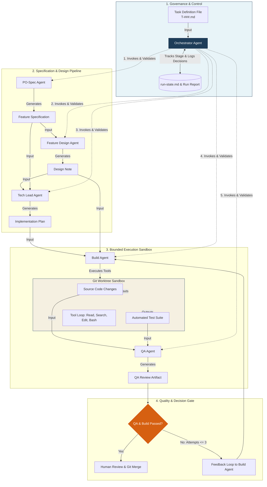
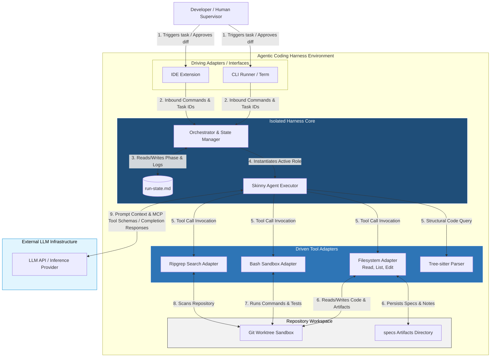
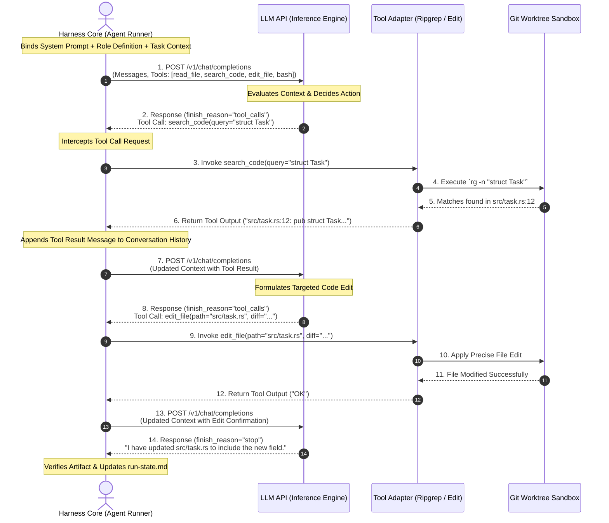
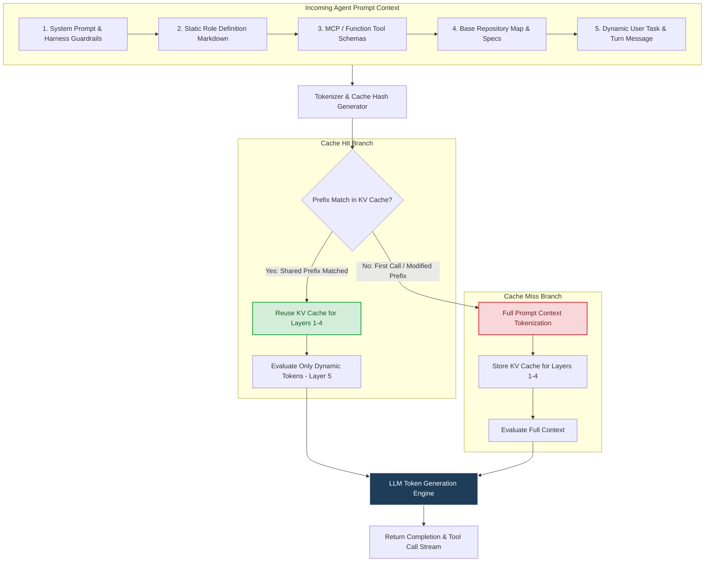

I have created the **Architectural Blueprint: The Agentic Coding Harness** report in your Studio panel, featuring full technical documentation and breakdown sections.

Below are the four detailed architecture and workflow diagrams for the coding agent harness, formatted in Mermaid.

---

### 1. Flowchart Diagram of a Coding Agent Harness Workflow

---

### 2. C4 Subsystem Diagram (Containers & Communication Interfaces)

---

### 3. Detailed Sequence Diagram: Harness & LLM Interaction with Tool Calling

---

### 4. Flowchart Diagram of Context Token Caching

---

💡 Would you like to inspect a sample **Tech Lead Implementation Plan template** or explore how to configure **context token caching headers** for your API requests?