# Spec-Driven Development Workflow

> **Status: Normative — single authority.** This document is the **single normative authority** for the spec-driven lifecycle, artifact responsibilities, state transitions, gates, and the spec-ready predicate. `specs/CONSTITUTION.md` is the single normative authority for .NET engineering rules, and `specs/CONSTITUTION_FRONTEND.md` is the single normative authority for `Web.Spa` (React/TS/Node) engineering rules (how the SPA is written). All other documents — including `AGENTS.md` — are **derivative / informational** summaries. If any derivative document conflicts with this one on workflow matters, **this document wins**. If this document conflicts with a Constitution on engineering form, the applicable Constitution wins and the conflict MUST be raised (see the applicable constitution's §0).

This workflow progressively turns product intent into a bounded,
implementation-ready feature packet. Work on one independently valuable
vertical slice at a time rather than specifying the entire product upfront.

## Normative Authority & Precedence

1. **Workflow authority:** `specs/SDD_WORKFLOW.md` (this file) — normative for lifecycle, artifact boundaries, gates, and readiness.
2. **Engineering authority:** `specs/CONSTITUTION.md` — normative for .NET engineering rules, layering, and quality gates; `specs/CONSTITUTION_FRONTEND.md` — normative for `Web.Spa` (React/TS/Node) engineering rules, typing, and quality gates.
3. **Skill enforcement:** Every workflow step defined in [`§Skill Mapping`](#skill-mapping) MUST be executed via its mapped skill under `.agents/skills/` (or project-equivalent skill path). Direct creation or editing of artifacts bypassing the skill, or manual `status` transitions bypassing `promote-artifact` / `verify-feature`, is non-conforming — even if the resulting artifact appears correct.
4. **Derivative / informational:** `AGENTS.md` (operational read-first guide), `README.md`, and `specs/templates/` content — MUST defer to (1), (2), and (3). Do not treat derivative summaries as gate definitions. Templates are source material for the skills; they are not a bypass.
5. **Strict promote-only transitions** (`specs/adr/ADR-002.md`): authoring skills write artifacts with `status: draft` only; **every** status transition — including the first approval — MUST go through `promote-artifact`. Chat confirmation approves the content to be written, never the lifecycle status.

```mermaid
flowchart TD
    PRD["Approved PRD<br/>why and product scope"]
    CONTEXT["Project context<br/>glossary, constitution, tech, context"]
    SLICE["Select one vertical feature slice"]
    EPIC["Refine epic brief (EPIC-NNN)<br/>outcome, boundaries, candidate slices"]
    EPIC_GATE{"Epic brief approved<br/>and no blocking questions?"}
    STORY["Refine user story (US-NNN)<br/>actor, goal, value, rules, scope"]
    STORY_GATE{"Story approved<br/>and no blocking questions?"}
    BEHAVIOR["Formulate executable behavior<br/>scenarios.feature"]
    BEHAVIOR_GATE{"Behavior unambiguous<br/>and approved?"}
    REQUIREMENTS["Define observable contracts<br/>requirements.md (REQ-NNN)"]
    REQ_GATE{"Requirements approved?"}
    DESIGN["Specify technical approach<br/>design.md (DES-NNN)"]
    ADR_GATE{"Consequential<br/>technical decision?"}
    ADR["Record decision and tradeoffs<br/>specs/adr/ADR-NNN.md"]
    DESIGN_GATE{"Design & ADRs approved?"}
    TASKS["Define ordered implementation<br/>and verification tasks (TASK-NNN)"]
    READY_GATE{"Spec-ready gate passed?<br/>All packet specs approved"}
    REVISE["Revise the relevant artifact"]
    PACKET["Implementation packet<br/>story + scenarios + requirements + design + tasks + ADRs + context"]

    RED_TEST["Write failing tests (RED)<br/>observable red output"]
    IMPLEMENT["Generate and implement code"]
    GREEN_TEST["Pass tests (GREEN)<br/>observable green output"]
    VERIFY["Run quality & domain<br/>gates with observed output"]
    REVIEW["Review implementation<br/>against approved specifications"]
    MATCH_GATE{"Behavior, tests, and evidence<br/>match the specifications?"}
    COMPLETE["Mark packet implemented<br/>and record verification evidence"]
    RELEASE["Compile release record<br/>specs/releases/REL-NNN.md"]
    ARCHIVE["Archive completed feature<br/>specs/archive/NNN-slug/"]
    NEXT["Select next slice or triage observations"]

    PRD --> SLICE
    CONTEXT --> SLICE
    SLICE --> EPIC
    EPIC --> EPIC_GATE
    EPIC_GATE -- "No: clarify" --> EPIC
    EPIC_GATE -- "Yes" --> STORY
    STORY --> STORY_GATE
    STORY_GATE -- "No: clarify" --> STORY
    STORY_GATE -- "Yes" --> BEHAVIOR
    BEHAVIOR --> BEHAVIOR_GATE
    BEHAVIOR_GATE -- "No: clarify story" --> STORY
    BEHAVIOR_GATE -- "Yes" --> REQUIREMENTS
    REQUIREMENTS --> REQ_GATE
    REQ_GATE -- "No: revise" --> REQUIREMENTS
    REQ_GATE -- "Yes" --> DESIGN
    DESIGN --> ADR_GATE
    ADR_GATE -- "Yes" --> ADR
    ADR -. "informs" .-> DESIGN
    ADR_GATE -- "No" --> DESIGN_GATE
    ADR --> DESIGN_GATE
    DESIGN_GATE -- "No: revise" --> DESIGN
    DESIGN_GATE -- "Yes" --> TASKS
    TASKS --> READY_GATE
    READY_GATE -- "No" --> REVISE
    REVISE --> STORY
    READY_GATE -- "Yes" --> PACKET

    PACKET --> RED_TEST
    RED_TEST --> IMPLEMENT
    IMPLEMENT --> GREEN_TEST
    GREEN_TEST --> VERIFY
    VERIFY --> REVIEW
    REVIEW --> MATCH_GATE
    MATCH_GATE -- "No: update specs first" --> REVISE
    MATCH_GATE -- "Yes" --> COMPLETE
    COMPLETE --> RELEASE
    RELEASE --> ARCHIVE
    ARCHIVE --> NEXT
    NEXT --> SLICE
```



## Shared Artifact Lifecycle

Normative. All specifications and supporting artifacts follow a shared, explicit state lifecycle. Every status transition MUST be performed via `promote-artifact` (strict promote-only, `specs/adr/ADR-002.md`); creating skills write artifacts as `draft` and MUST NOT advance status:

| Status | Meaning | Promotion condition |
| --- | --- | --- |
| `draft` | Artifact is being authored or revised | Created by its mapped skill (see `§Skill Mapping`) — manual creation bypassing the skill is non-conforming; skills never advance beyond `draft` |
| `in-review` | Artifact authoring complete, awaiting semantic review | `promote-artifact` after checklist validation |
| `approved` | Semantic behavior and boundaries confirmed by human reviewer | Human confirmation via `promote-artifact` (see `§Skill Mapping`) |
| `implemented` | Implementation and verification executed with observed passing evidence | `verify-feature` + test evidence recorded, transitioned by `promote-artifact` |
| `archived` | Feature is delivered and archived from active context | Relocated to `specs/archive/` by `record-release`, transitioned via `promote-artifact` |
| `released` | Release milestone is verified and closed | Release record is validated and transitioned by `promote-artifact` |
| `superseded` | Replaced by a newer artifact (requires `supersedes` / `superseded_by`) | Successor artifact approved via its mapped skill + `promote-artifact` |

## Artifact Boundaries

Normative. Each artifact type has a single responsibility; a downstream artifact MUST NOT silently redefine or contradict an upstream approval:

- PRDs define product intent, outcomes, scope, constraints, and boundaries.
- Epic briefs refine an approved PRD epic into outcome, capability boundaries, candidate slices, and success criteria without authoring stories or prescribing implementation.
- User stories define business intent and observable value without prescribing implementation.
- Gherkin scenarios define executable behavioral examples.
- Requirements define externally observable contracts.
- Design documents define how approved behavior will be realized.
- ADRs preserve consequential decisions, alternatives, and tradeoffs.
- Diagrams (`CHART-NNN`) serve as the central repository of Mermaid-formatted diagrams to conceptualize architecture, design, and business processes without replacing inline diagrams in feature files.
- Databases (`DB-NNN`) and Tables (`TABLE-NNN`) define the physical and logical database schemas, with strict frontmatter references between tables and their parent database.
- Tasks define implementation order and verification, but MUST NOT silently change behavior.

## Artifact Responsibilities

Normative. Canonical artifact locations, ID prefixes, and completion gates:

| Artifact | ID Prefix | Defines | Completion gate |
| --- | --- | --- | --- |
| `specs/prds/PRD-NNN.md` | `PRD-` | Product vision, outcomes, epics, constraints, and boundaries | Product intent is approved |
| `specs/prds/PRD-NNN-epics/EPIC-NNN.md` | `EPIC-` (per-PRD scoped) | Refined epic outcome, capability boundaries, candidate slices, and success criteria | Epic outcome is refined & approved |
| `user-story.md` | `US-` | Actor, goal, value, business rules, examples, and scope | Story is valuable, small, testable, and approved |
| `scenarios.feature` | N/A (`# parent: US-NNN`) | Executable behavioral examples, including failure and boundary cases | Scenarios are unambiguous and approved |
| `requirements.md` | `REQ-` | Inputs, outputs, validation, errors, invariants, and quality requirements | Every requirement traces to behavior & approved |
| `design.md` | `DES-` | Components, interfaces, state flow, technical choices, risks, and verification | The implementation approach is explicit & approved |
| `specs/adr/ADR-NNN.md` | `ADR-` | Durable decisions, alternatives, tradeoffs, and consequences | Consequential decisions are recorded & approved |
| `specs/schema/TABLE-NNN.md` | `TABLE-` | Table schema, DDL, column types, invariants, and database links | Schema is reviewed & approved |
| `specs/schema/DB-NNN.md` | `DB-` | Database engine, location, migration version, and table catalog | Database schema is approved |
| `tasks.md` | `TASK-` | Ordered implementation work, red-test plan, and completion checks | Each task is actionable and verifiable |
| `specs/releases/REL-NNN.md` | `REL-` | Released features, fixed observations, eval scores, and verification evidence | Release milestone verified & closed |

## Identifier Rules

Normative. Use independent monotonically increasing sequences for PRD, ADR, user-story, requirements, design, tasks, chart, database, table, observation, and release artifact types:

- PRDs use `PRD-NNN` and live at `specs/prds/PRD-NNN.md`.
- Epic briefs reuse the parent PRD's per-PRD `EPIC-NNN` identifier and live at `specs/prds/PRD-NNN-epics/EPIC-NNN.md`; the ID MUST match the epic row in the parent PRD and is never reused across PRDs.
- Feature packets stay flat at `specs/NNN-feature-slug/` regardless of epic ownership (`specs/adr/ADR-004.md`); ownership is recorded in frontmatter (`parent: PRD-NNN`, `epic: EPIC-NNN`) and validated via `promote-artifact`, never encoded in packet paths.
- ADRs use `ADR-NNN` and live under `specs/adr/`.
- User stories use `US-NNN` and live at `specs/NNN-feature-slug/user-story.md`.
- Requirements use `REQ-NNN` and live at `specs/NNN-feature-slug/requirements.md`.
- Designs use `DES-NNN` and live at `specs/NNN-feature-slug/design.md`.
- Tasks use `TASK-NNN` and live at `specs/NNN-feature-slug/tasks.md`.
- Diagrams use `CHART-NNN` and live at `specs/charts/CHART-NNN.md`.
- Databases use `DB-NNN` and live at `specs/schema/DB-NNN.md`.
- Tables use `TABLE-NNN` and live at `specs/schema/TABLE-NNN.md`.
- Observations use `OBS-NNN` and live in `specs/TODO.md` or `specs/observations/`.
- Releases use `REL-NNN` and live at `specs/releases/REL-NNN.md`.
- `NNN` is exactly three zero-padded decimal digits.
- Each prefix has its own independent sequence; creating `ADR-001` or `CHART-001` does not advance PRD, DB, or TABLE numbering.
- Allocate the next number above every existing active, archived, or superseded artifact of the same type.
- Never reuse an ID, including after deletion, archiving, or supersession.
- Preserve an ID when revising or moving an artifact.
- Template placeholders such as `PRD-NNN`, `ADR-NNN`, `US-NNN`, `CHART-NNN`, `DB-NNN`, and `TABLE-NNN` do not consume numbers.
- Database and table files MUST start with a YAML frontmatter header that maintains strict bidirectional references between tables and databases (`database: DB-NNN` in table frontmatter, `tables: [TABLE-NNN, ...]` in database frontmatter).
- Scan existing artifacts before allocating an ID and stop if a collision is found.

The `NNN` sequence is repository-wide for each prefix. Feature packet
directories are numbered independently from the artifact IDs they contain.
## Template Rules

Normative:

- Use templates from `specs/templates/` when creating new artifacts.
- Replace all illustrative content, placeholder metadata, and example domain behavior before approval.
- Never treat the former `specs/001-short-feature-slug/` directory or its sample delivery-address content as a real feature.
- Never treat `specs/templates/supporting/adr.md` as an approved ADR.
- Do not create downstream feature files merely as empty placeholders; create them when the preceding artifact is ready.

## Spec-Ready Checklist

A feature is ready for code generation only when the **Spec-Ready Predicate** passes:

- The parent PRD is approved.
- The parent epic brief (`specs/prds/PRD-NNN-epics/EPIC-NNN.md`) is `status: approved`.
- `user-story.md` is `status: approved`.
- `scenarios.feature` has `# status: approved` and covers happy, alternate, failure, and boundary paths.
- `requirements.md` is `status: approved` and contains no unresolved `TBD` values in normative sections.
- `design.md` is `status: approved` with explicit external interfaces, data contracts, errors, and state transitions.
- All referenced ADRs (`specs/adr/ADR-NNN.md`) and schemas are `status: approved`.
- `tasks.md` is `status: approved`, orders tasks by dependency, and includes red/green test steps.
- All `depends_on` feature dependencies are in `status: implemented`.
- No open blocking questions remain (`blockers: []`).
- All cross-references between artifacts resolve cleanly.

Observation records are operational records rather than specification artifacts.
They may use the observation-specific intake states defined by their template;
when promoted, `promoted_to` is the authoritative destination reference.

## Skill Mapping

Normative. Each workflow step MUST be executed via its mapped skill. The table is the single source of truth for how the step is performed; bypassing the skill (manual file creation, copy-paste from templates, or ad-hoc `status` edits) violates the workflow even if the artifact looks correct.

| Workflow step | Skill | Primary Output / Action |
| --- | --- | --- |
| Product intent | `create-prd` | `specs/prds/PRD-NNN.md` |
| Epic refinement | `refine-epic` | `specs/prds/PRD-NNN-epics/EPIC-NNN.md` |
| Story refinement | `refine-user-stories` | `specs/NNN-feature-slug/user-story.md` |
| Executable behavior | `user-story-to-gherkin` | `specs/NNN-feature-slug/scenarios.feature` |
| Observable contract | `create-requirements` | `specs/NNN-feature-slug/requirements.md` |
| Technical approach | `create-design` | `specs/NNN-feature-slug/design.md`, ADRs, and supporting CHART/DB/TABLE artifacts when required |
| Implementation plan | `create-tasks` | `specs/NNN-feature-slug/tasks.md` |
| Artifact promotion | `promote-artifact` | Promotes artifact status upon checklist validation |
| Feature implementation | `implement-feature` | Test-driven implementation (RED -> GREEN -> REFACTOR) |
| Feature verification | `verify-feature` | Quality & evaluation execution, updates `tasks.md` evidence |
| Observation triage | `triage-observation` | Records, classifies, and routes issues in `specs/TODO.md` |
| Release recording | `record-release` | Compiles release record in `specs/releases/REL-NNN.md` and relocates delivered packets to `specs/archive/` |

## Constitutional Engineering Loop

Give the implementation agent the complete feature packet:

```text
user-story.md
scenarios.feature
requirements.md
design.md
tasks.md
related ADRs and schemas
specs/CONSTITUTION.md        (when C#/.NET code is in scope)
specs/CONSTITUTION_FRONTEND.md (when Web.Spa React/TS code is in scope)
```

The agent must follow the non-negotiable Constitutional loop:
1. **Red Test**: Author failing unit, integration, or scenario tests. Observe failure output.
2. **Implementation**: Write minimal production code satisfying the failing tests.
3. **Green Test**: Observe passing test output.
4. **Refactor & Trace**: Clean up code and verify traceability (`R-SDD-02`).
5. **Quality Gates**: Run the project's required quality and evaluation gates with observed output, and record the evidence in `tasks.md`. Concrete commands, tools, thresholds, and Definition of Done checks are defined by the applicable Constitution(s) — `specs/CONSTITUTION.md` for C#/.NET, `specs/CONSTITUTION_FRONTEND.md` for `Web.Spa` — and the evaluated PRD/ADR constraints — **do not define tool-specific gates here**. This workflow step requires that those gates exist, pass, and leave evidence; the applicable Constitution (and domain evaluation criteria) define what "pass" means.

If implementation reveals a specification ambiguity or behavioral change, stop immediately and update the specifications before altering code.
## Editing and Verification

Normative for workflow changes (engineering verification is additionally governed by the applicable Constitution — `specs/CONSTITUTION.md` for C#/.NET, `specs/CONSTITUTION_FRONTEND.md` for `Web.Spa` — and applicable domain evaluation criteria):

- Inspect existing files and related specifications before editing.
- Do not overwrite an existing artifact silently.
- Keep front matter, IDs, parent references, statuses, and traceability consistent.
- Verify changed Markdown paths and internal references.
- Keep Mermaid diagrams in fenced `mermaid` blocks.
- For documentation-only changes, verify paths, links, IDs, and stale references.
- Run relevant implementation checks when application code exists.
- For engineering changes, execute the project's required gates defined by the applicable Constitution (see `specs/CONSTITUTION.md` / `specs/CONSTITUTION_FRONTEND.md`) and report observed command output; do not claim completion from intent.
- Do not commit or publish changes unless explicitly requested.
