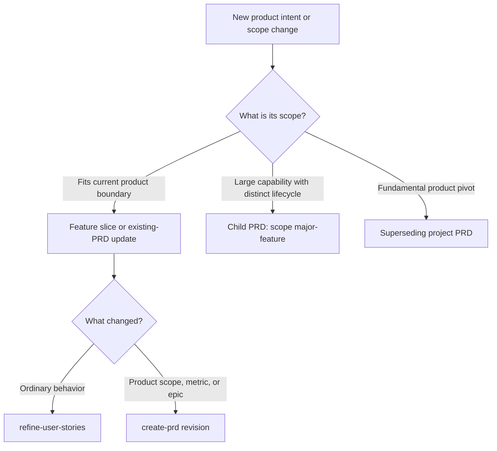

# PRD Lifecycle Guide

> **Status: operational guide, subordinate to the normative authorities.**
> `specs/SDD_WORKFLOW.md` defines the lifecycle and `create-prd` is the mapped
> authoring skill. Use this guide to choose the appropriate PRD scope.

## Core Decision Rule

- Update the current project PRD when the product vision, metrics, boundaries,
  decisions, or epic list evolves within the existing product boundary.
- Create a child PRD with `scope: major-feature` when a large capability has
  distinct personas, journeys, metrics, and multiple epics.
- Create a new project PRD only for a fundamental product or paradigm pivot. It
  supersedes the previous project PRD through `promote-artifact`.
- Do not create or update a PRD for an ordinary feature slice, bug fix, or
  technical decision. Use a feature packet or ADR instead.

## Decision Framework



## In-Place Project PRD Updates

Use `create-prd` in revision mode when changing the current product vision,
adding an epic, resolving a product question, changing a metric, or adjusting a
capability boundary.

Rules:

- Preserve the existing PRD ID.
- Bump `updated`.
- Preserve existing epic IDs and append new IDs monotonically.
- Record material product decisions in the PRD decision log.
- Preserve unresolved questions unless the user explicitly resolves them.
- Write the revision as `draft`; use `promote-artifact` for review and approval.

## Major-Feature PRDs

Use `create-prd` with `scope: major-feature` when the capability is too large or
distinct to keep in the project PRD.

```yaml
id: PRD-NNN
scope: major-feature
status: draft
parent: PRD-001
related: [PRD-001]
```

The child PRD gets its own personas, journeys, metrics, scope, constraints, and
epic list. It still participates in the same feature-packet workflow.

## Superseding Project PRDs

Use a new `scope: project` PRD only for a fundamental change to the product
mission or operating model.

1. Author the successor with `create-prd` and `status: draft`.
2. Promote the successor through review to `approved`.
3. Promote the predecessor to `superseded` and set `superseded_by`.
4. Set the successor's `supersedes` field and preserve both records.

Do not rewrite historical decisions or reuse the predecessor's ID.

## What Does Not Belong In A PRD

- Feature-level behavior belongs in a feature packet.
- Technical choices belong in ADRs.
- Database details belong in database/table specifications.
- Implementation order belongs in `tasks.md`.
- Post-release defects and technical debt belong in observations.

## Traceability

The chain remains:

```text
PRD -> epic brief -> user story -> scenarios -> requirements -> design -> tasks
```

Use `parent`, `epic`, `depends_on`, `requires`, `blockers`, and `related` for
explicit relationships. All IDs follow `specs/SDD_WORKFLOW.md`.
