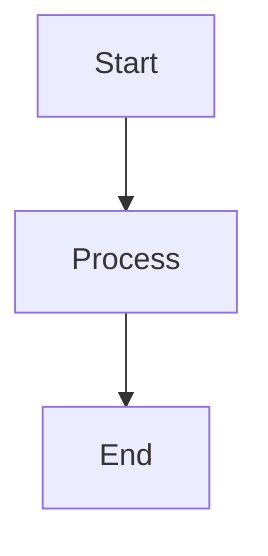

# Chart

<!-- Supporting artifact. Central repository for a Mermaid-formatted diagram
conceptualizing architecture, design, domain models, or business processes. -->

## Context And Purpose

TBD

## Diagram

## Element Dictionary

| Element | Type | Description |
| --- | --- | --- |
| TBD | TBD | TBD |

## Notes And Invariants

- TBD
